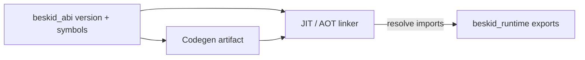

import SpecArticleChrome from '@beskid/beskid-ui/platform-spec/SpecArticleChrome.astro';

<SpecArticleChrome />

## Purpose

Define how the **compiler**, **JIT/AOT backends**, and **Beskid runtime** agree on a single numeric ABI version and a frozen export surface so generated code never calls missing or mis-typed runtime entrypoints.

## Primary actors

| Actor | Responsibility |
| --- | --- |
| **`beskid_abi`** | Owns `BESKID_RUNTIME_ABI_VERSION`, `RUNTIME_EXPORT_SYMBOLS`, and builtin signature metadata consumed by codegen. |
| **`beskid_codegen` / `beskid_engine`** | Declares imports from `BUILTIN_SPECS` and validates user `Extern` shapes before linking. |
| **`beskid_runtime`** | Implements `#[unsafe(no_mangle)]` exports; `beskid_runtime_abi_version()` returns the compile-time constant. |
| **Host tooling** | JIT session and AOT link steps load the same runtime artifact the compiler was built against (or an explicitly compatible newer runtime). |

## Subsystem boundaries

- **In scope:** ABI integer version, additive vs breaking symbol changes, JIT symbol registration parity with AOT, and migration expectations when bumping `BESKID_RUNTIME_ABI_VERSION` in `compiler/crates/beskid_abi/src/version.rs`.
- **Out of scope:** Language-level `Extern` syntax ([FFI and extern](/platform-spec/language-meta/interop/ffi-and-extern/)), C link-time profiles ([C ABI profile](/platform-spec/language-meta/interop/c-abi-profile/)), and per-builtin semantics ([Builtins and symbols](/platform-spec/execution/abi-and-host/builtins-and-symbols/)).

## Version and symbol model

The ABI version is a **`u32`** exposed as `beskid_runtime_abi_version`. The reference tree currently pins **`BESKID_RUNTIME_ABI_VERSION = 2`**. A bump is required when any of the following change incompatibly:

- C layout of `BeskidStr`, `BeskidArray`, or interop payload offsets referenced by lowering.
- Name, parameter count, or `AbiParamKind` / `AbiReturnKind` of a builtin in `BUILTIN_SPECS`.
- Semantics that generated code already depends on (for example making `gc_write_barrier` a no-op when lowering assumes barriers run).

Additive changes (new symbols appended to `RUNTIME_EXPORT_SYMBOLS`, new optional runtime `features`) **should not** require a version bump if existing artifacts keep working without recompilation.

## Compatibility diagram

Codegen and the engine read the **same** `beskid_abi` crate revision at build time. At run time, hosts **should** treat a lower runtime version than the compiler expects as a hard compatibility failure before executing user code.

## Platform assumptions (v0.2 baseline)

Reference implementations target **64-bit pointers** and Linux x86_64 for syscall-backed builtins; other hosts may stub behavior but must preserve symbol names and Cranelift signature shapes declared in `BUILTIN_SPECS`.

## Implementation anchors
- `compiler/crates/beskid_abi/src/version.rs` — `BESKID_RUNTIME_ABI_VERSION` constant and version negotiation
- `compiler/crates/beskid_abi/src/symbols.rs` — `RUNTIME_EXPORT_SYMBOLS` registry
- `compiler/crates/beskid_abi/src/builtins.rs` — `BUILTIN_SPECS` signature catalog

## Related topics

- [Flow and algorithm](./flow-and-algorithm/) — JIT registration and version check ordering
- [Contracts and edge cases](./contracts-and-edge-cases/) — normative ABI-00x requirements
- Legacy bridge: [Runtime ABI (v0.1)](../../../../execution/runtime/runtime-abi-v0-1.md)
