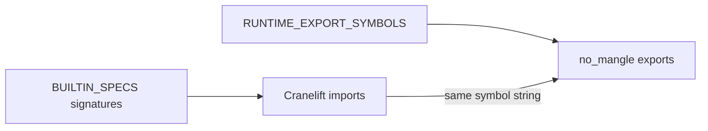

import SpecArticleChrome from '@beskid/beskid-ui/platform-spec/SpecArticleChrome.astro';

<SpecArticleChrome />

## Purpose

Document the **dual registry** that connects Beskid lowered code to the host runtime: symbolic names for the linker (`RUNTIME_EXPORT_SYMBOLS`) and machine signatures for Cranelift (`BUILTIN_SPECS`).

## Primary actors

| Actor | Artifact |
| --- | --- |
| **`beskid_abi::builtins`** | `BuiltinFnSpec { symbol, params, returns }` entries |
| **`beskid_abi::symbols`** | `SYM_*` constants + `RUNTIME_EXPORT_SYMBOLS` list |
| **`beskid_codegen`** | `declare_builtin_imports` builds Cranelift `FuncId`s from specs |
| **`beskid_runtime::builtins`** | `#[unsafe(no_mangle)] pub extern "C-unwind"` implementations |

## Builtin families

| Family | Examples | Consumer |
| --- | --- | --- |
| **Allocation / values** | `alloc`, `str_new`, `str_concat`, `array_new` | All backends |
| **GC** | `gc_write_barrier`, `gc_collect`, `gc_root_handle` | Lowering + host snapshots |
| **Fibers** | `fiber_spawn`, `fiber_yield`, `fiber_join_value` | `corelib_concurrency` |
| **Channels / hubs** | `channel_send`, `hub_wait_receive_value` | Concurrency package |
| **Sync** | `mutex_lock`, `wait_group_wait` | Runtime scheduler |
| **Interop** | `interop_dispatch_unit`, `interop_dispatch_ptr` | Tagged interop lowering |
| **IO / faults** | `syscall_write`, `panic`, `panic_str` | Corelib + traps |
| **Diagnostics** | `test_bytes_ptr` (test-only) | Compiler tests |

Return kinds include **`AbiReturnKind::Never`** for diverging `panic` calls so Cranelift marks unreachable correctly.

## Data layout contracts

- **`BeskidStr`**: `{ ptr, len }` UTF-8 bytes (immutable; length in bytes).
- **`BeskidArray`**: `{ ptr, len, cap }`; element storage optional behind runtime `arrays_backing` feature ([Runtime feature flags](/platform-spec/execution/runtime/runtime-feature-flags/)).

## Registry diagram

## Related topics

- [ABI versioning](/platform-spec/execution/abi-and-host/abi-versioning-and-compatibility/) — when to bump version after symbol changes
- [Flow and algorithm](./flow-and-algorithm/)
