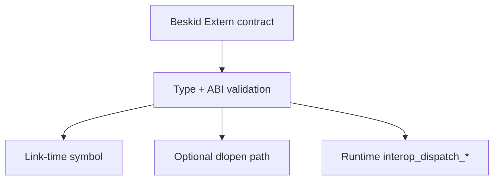

import SpecArticleChrome from '@beskid/beskid-ui/platform-spec/SpecArticleChrome.astro';

<SpecArticleChrome />

## Purpose

Separate **who declares** foreign calls, **who validates** signatures, and **who resolves** addresses at link or run time. User `Extern` libraries and runtime builtins follow different policy tracks.

## Primary actors

| Actor | Role |
| --- | --- |
| **Front-end / analysis** | Parses `Extern` contracts, emits diagnostics for disallowed types (`compiler/crates/beskid_analysis`). |
| **Codegen** | Lowers approved calls to Cranelift `call` targets—either runtime builtins or imported extern symbols. |
| **Engine (`beskid_engine`)** | Optional `extern_dlopen` path: `dlopen` / `dlsym` with caches (legacy v0.1; **Proposed** for new work—prefer link-time [C ABI profile](/platform-spec/language-meta/interop/c-abi-profile/link-time-linking/)). |
| **Runtime builtins** | `interop_dispatch_unit`, `interop_dispatch_ptr`, `interop_dispatch_usize` bridge language/runtime interop layouts (`beskid_runtime::interop`). |

## Dispatch layers

**Link-time (Standard v0.3):** User libraries resolve when producing AOT/JIT artifacts; addresses are fixed before execution.

**Dynamic (legacy):** Engine loads `Library` + `Symbol` strings from `Extern(Abi:"C", Library:"…")` metadata when `extern_dlopen` is enabled.

**Runtime dispatch:** Compiler-generated thunks call `interop_dispatch_*` for tagged interop values; layout offsets are stable per ABI version ([ABI versioning](/platform-spec/execution/abi-and-host/abi-versioning-and-compatibility/)).

## Policy boundaries

- Lowering **must not** embed OS-specific syscall behavior for user externs; syscalls remain in [Panic, IO, and syscalls](/platform-spec/execution/runtime/panic-io-and-syscalls/).
- Allowed Cranelift scalar kinds for engine-validated externs: pointer-width integer, `i64`, `i32`, `i8`, `f64` (legacy [Extern policy v0.1](../../../../execution/runtime/extern-policy-v0-1.md)).
- High-level Beskid types in extern signatures **must** be rejected before codegen.

## Implementation anchors
- `compiler/crates/beskid_analysis/src/` — `Extern` contract parsing and type validation
- `compiler/crates/beskid_codegen/src/` — extern call lowering to Cranelift targets
- `compiler/crates/beskid_runtime/src/interop/` — `interop_dispatch_*` runtime builtins

## Related topics

- [Flow and algorithm](./flow-and-algorithm/)
- [Interop.Contracts](/platform-spec/language-meta/interop/interop-contracts/)
