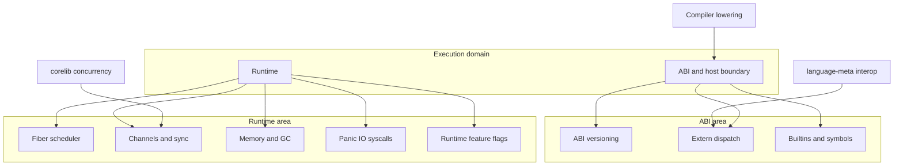

import SpecPageHeader from '@beskid/beskid-ui/platform-spec/SpecPageHeader.astro';
import SpecSection from '@beskid/beskid-ui/platform-spec/SpecSection.astro';
import DomainTiles from '@beskid/beskid-ui/platform-spec/DomainTiles.astro';

<SpecPageHeader
	ownerName="Piotr Mikstacki"
	ownerEmail="pmikstacki@cybernomad.it"
	submitterName="Piotr Mikstacki"
	submitterEmail="pmikstacki@cybernomad.it"
/>

<SpecSection title="Rationale" id="rationale">
This domain is the normative execution surface for runtime behavior, ABI boundaries, fiber scheduling, channel synchronization, and host interactions. It is authored from implementation crates and test behavior; legacy `/execution/` pages redirect here for concurrency topics formerly described only as v0.1 stubs.
</SpecSection>

<SpecSection title="Domain map" id="domain-map">

</SpecSection>

<DomainTiles pathPrefix="platform-spec/execution" heading="Areas" />
