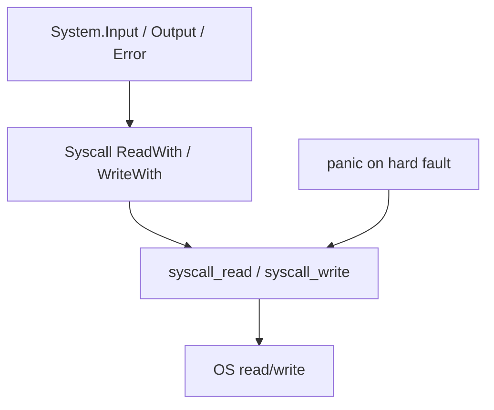

import SpecArticleChrome from '@beskid/docs-ui/platform-spec/SpecArticleChrome.astro';

<SpecArticleChrome />

## Purpose

Define runtime ownership of **unrecoverable faults** (`panic`) and **platform IO** (`syscall_read`, `syscall_write`). Front-end and corelib **must not** embed OS-specific syscall sequences in lowering.

## Primary actors

| Actor | Role |
| --- | --- |
| **Lowering** | Emits `panic` for unrecoverable checks; routes corelib IO to builtins |
| `beskid_runtime::builtins::panic_io` | Linux x86_64 syscall asm; stdio fallback elsewhere |
| **Scheduler** | `run_blocking` for syscall work without violating GC mutator rules |
| **Corelib `System.Syscall`** | Wraps builtins with descriptors ([Console I/O streams](/platform-spec/core-library/terminal-and-console/console-io-streams/)) |

## Failure model split

| Mechanism | Use |
| --- | --- |
| `Option<T>` (language) | Expected errors — canonical in language-meta |
| **`panic` / `panic_str`** | Unrecoverable faults, failed writes in v1 streams, allocation failures |

Runtime panics **terminate** the process (trap). There is no Beskid stack unwinding across panics.

## IO boundary

Syscall builtins accept **file descriptor + buffer** (`syscall_write` uses `BeskidStr`). They return integer status codes; corelib maps EOF/errors to `Result`.

## Platform scope

Reference implementation: **Linux x86_64** direct syscalls for performance. Other targets may delegate to `std::io` for fds 1/2 while preserving signatures (**IO-ABI-003**).

## Related topics

- [Flow and algorithm](./flow-and-algorithm/)
- Legacy: [Error model](../../../../execution/runtime/error-model.md), [Syscalls and ABI boundary](../../../../execution/runtime/syscalls-and-abi-boundary.md)
