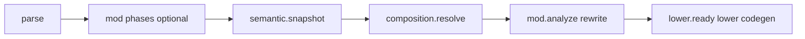
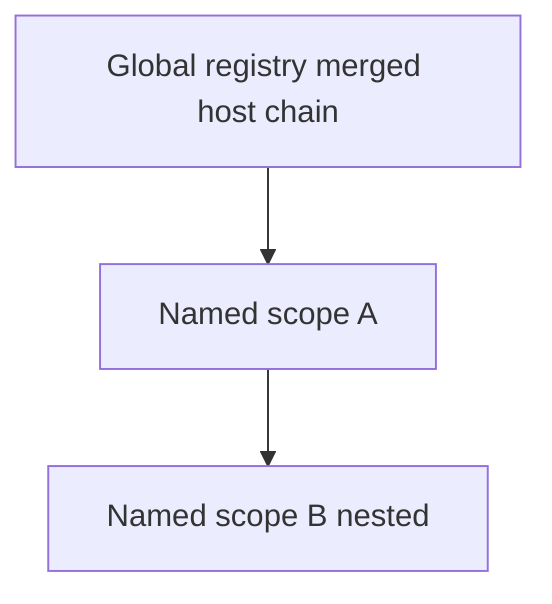

import SpecArticleChrome from '@beskid/docs-ui/platform-spec/SpecArticleChrome.astro';

<SpecArticleChrome />

## Compile pipeline placement

| Id | Constant (planned) | Emitter |
| --- | --- | --- |
| `composition.resolve` | `COMPOSITION_RESOLVE` | `beskid_analysis` composition pass |

## `composition.resolve` algorithm (normative)

1. **Resolve launch host** — From the **`app`** (application) target entry, determine the **`launch Host`** expression and the **`Host`** type. Reject **`Lib`** targets containing **`launch`** (**E1711**). Reject multiple **`launch`** on the entry path (**E1702**).
2. **Collect host declarations** — All named **`host`** types in the compilation; verify the launched type exists.
3. **Merge host chain** — Walk **`: ParentHost`** from base (corelib) to **launched** host; merge each **`registry`**. **Launched host overrides** duplicate keys. Reject lifetime kind changes on override (**E1713**).
4. **Build scope tree** — Attach top-level **`scope`** nodes to **global**; nest child **`scope`** declarations under parents.
5. **Build service graph** — Nodes for registrations; edges from **field `inject`**, **`init`**, **`dispose`**, **`startup`** parameters. Support **array edges** (plural inject aggregates multiple registration nodes).
6. **Validate inject sites** — Singular vs plural rules; **`global::`** / **`parent::`**; forbid constructor **`inject`** (**E1712**).
7. **Validate lifetimes and activations** — Global vs named scope; **`with`** nesting; parent scope rule.
8. **Freeze binding plan** — Field slot indices, array wiring order, scope enter (`init`) / leave (`dispose`) hooks.
9. **Export composition snapshot** — Versioned; read-only for mods after **`semantic.snapshot`**.

## Resolution container (singular vs plural)

For each inject site the compiler chooses a **resolution container**:

- Default: start at **innermost active named scope** on the stack (compile-time: the scope context of the field or hook); walk toward **global**.
- **`global::`**: use merged **global** `registry` only.
- **`parent::`**: skip innermost; start one level up.

**Singular:** exactly one registration at the chosen level (first matching level when walking). **Plural `T[]`:** collect **all** registrations for that contract (or self-bind type) at the **first level that has ≥1** match, in deterministic registration order.

## Lowering

- **Global `single` / `transient`** — Process-wide factories for the **`launch`** lifetime.
- **Field `inject`** — Initialize fields before user constructors run (order respects dependency graph).
- **`with`** — Push scope frame → **`init`** → body → **`dispose`** → pop.
- **`launch`** — Build global container → **`startup`** → base host run entry.

JIT and AOT share one plan.

## Runtime scope stack

Fiber-local stack: **`[ Global, … named scopes ]`**. No runtime lookup by name; frame indices from the binding plan.

## LSP / incremental

Re-run **`composition.resolve`** when **`host`**, **`registry`**, **`scope`**, **`with`**, field **`inject`**, **`startup`**, **`init`**, **`dispose`**, **`launch`**, or registered type shapes change.

## Package graph

**`Lib`** assemblies may export **`host`** types. The **`app`** host **`launch`**es; **`CompilePlan`** supplies types for registrations. Library **`registry`** entries merge only through **`: ParentHost`**, not automatically into unrelated app hosts.
