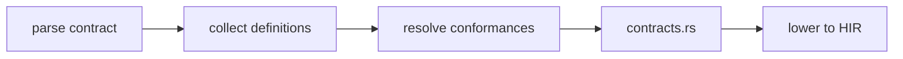

import SpecArticleChrome from '@beskid/beskid-ui/platform-spec/SpecArticleChrome.astro';

<SpecArticleChrome />

## Vocabulary

| Construct | Role |
| --- | --- |
| **`ContractDefinition`** | Declares required members (method signatures and embeddings) |
| **`ContractNode`** | Either a method signature or an embedded contract reference |
| **`ContractEmbedding`** | Flattened member requirements from another contract |
| **`ContractMethodSignature`** | Method signature without body inside a contract |

## Contract architecture

Contracts are **structural interfaces** checked at compile time. Types implement contracts via conformance lists (`: I, J`).

### Subsystem boundaries

| Subsystem | Responsibility | Key file |
| --- | --- | --- |
| Parser | Parse `contract` and `ContractNode` | `syntax/items/contract_definition.rs` |
| AST | Store contract structure | `syntax/items/contract_node.rs` |
| Resolver | Bind conformance targets | `resolve/` |
| Contract rules | Check satisfaction | `analysis/rules/staged/contracts.rs` |
| HIR lowering | Embed contract metadata | `hir/lowering/items.rs` |

## Embedding model

Contracts may embed other contracts (`OtherContract;` inside a contract body). This flattens member requirements without inheritance syntax. Conflicting embedded methods emit **E1004**.

## Distinction from Mod SDK

This user-language `contract` surface is distinct from compiler Mod SDK contracts. Mod contracts follow the [Compiler Mod SDK](/platform-spec/language-meta/metaprogramming/compiler-mod-sdk/) specification.
