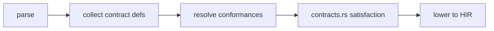
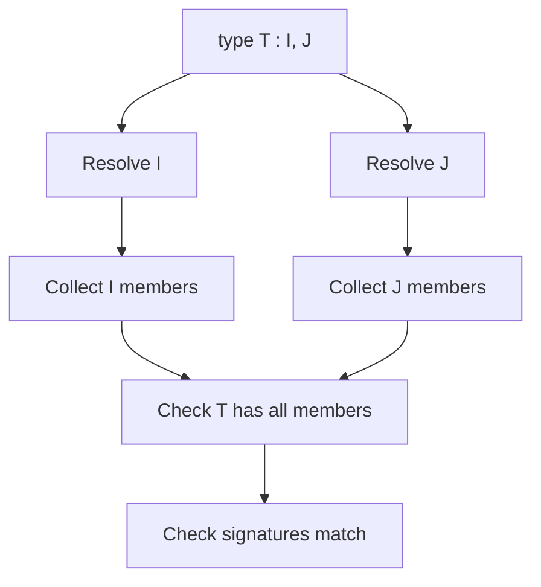

import SpecArticleChrome from '@beskid/beskid-ui/platform-spec/SpecArticleChrome.astro';

<SpecArticleChrome />

## Compile pipeline placement

## Contract satisfaction algorithm (normative)

1. **Parse contract definitions** — `ContractDefinition` stores `name`, `items` (method signatures + embeddings), and per-item docs.
2. **Collect contract nodes** — `ContractNode` enum distinguishes `MethodSignature` from `Embedding`.
3. **Resolve conformance lists** — For each `type T : I, J { }`, resolve `I` and `J` to actual contract definitions. `ResolveInvalidConformanceTarget` (**E1607**) for invalid targets.
4. **Check member presence** — For each required contract method, verify the implementing type declares a method with the same name. `ContractMethodMissingImplementation` (**E1601**) otherwise.
5. **Check signature compatibility** — Compare parameter and return types. `ContractImplementationSignatureMismatch` (**E1602**) if they differ.
6. **Check embedding conflicts** — If two embedded contracts define the same method name, `ConflictingEmbeddedContractMethod` (**E1004**) fires.
7. **Check duplicate contract methods** — `DuplicateContractMethod` (**E1003**) for duplicate names within one contract.

## Conformance list processing

## LSP / incremental

Re-run contract checking when contract definitions, type conformances, or method signatures change.
