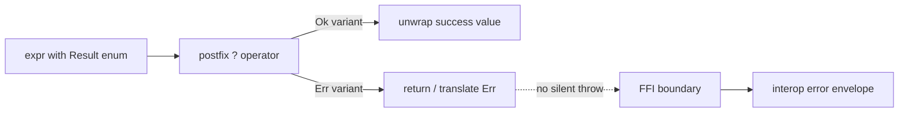

import SpecPageHeader from '@beskid/beskid-ui/platform-spec/SpecPageHeader.astro';
import SpecSection from '@beskid/beskid-ui/platform-spec/SpecSection.astro';

<SpecPageHeader
	status="Standard"
	ownerName="Piotr Mikstacki"
	ownerEmail="pmikstacki@cybernomad.it"
	submitterName="Piotr Mikstacki"
	submitterEmail="pmikstacki@cybernomad.it"
/>

## Error propagation flow

## Normative specification

### Scope

Defines how **recoverable failures** are represented and propagated in user code. ABI envelopes and unwind across FFI are in interop and execution chapters.

### `Result`, `Option<T>`, and enums

- Recoverable errors **should** use **`Core.Results.Result<TValue, TError>`** from corelib when the project links **Std** (prelude exposes `Core.Results`).
- In **App** projects with implicit **Std**, the assembly module path is **`Std::Core::Results`** (source may write ``Std.Core.Results.Result<i32, string>``); inside corelib shards the path remains ``Core.Results.Result<_, _>``.
- There is **no** built-in `Result<T,E>` type alias in v0.1 grammar; use the corelib generic enum with explicit type arguments.
- Projects **must not** define a second bare `enum Result` in the same scope as Std; use the corelib type or a distinct name.
- **Absence of value** (not failure) **must** use `Option<T>`, not `null` or sentinel pointers (**must** align with [Types](/platform-spec/language-meta/type-system/types/)).

### `try` postfix operator

- Postfix `expr?` (`TryOperator`) **must** apply only where the surrounding function or lambda declares a compatible error propagation target.
- Operand type **must** be a `Result`-shaped enum (typically ``Core.Results.Result<_, _>`` with `Ok` / `Error` variants); otherwise **invalid try target** (**E12xx** family in reference compiler).
- Successful path **must** unwrap the success payload type into the expression context; failure path **must** return or translate to the enclosing error type.
- Lowering **must** desugar `?` using the **resolved scrutinee enum** (variant names from that enum), not hard-coded identifier strings.
- **Analyze**, **compile** (`run` / `build`), and **LSP** **must** share the same typed-HIR spine: resolve, normalize (including `?` desugar), re-resolve, then type-check.

### Static rules

- `try` **must not** appear on non-enum/non-result expressions.
- Panic or abort semantics **are not** language keywords in v0.1; unrecoverable failures use host/runtime policies.

### Dynamic semantics

- Error propagation **must not** implicitly allocate; lowering rewrites `?` to branch sequences.
- FFI boundaries **must** map errors per [Interop contracts](/platform-spec/language-meta/interop/interop-contracts/) — no silent cross-language exceptions unless documented.

### Diagnostics

**InvalidTryTarget** and type mismatch on unwrap paths. Registry: [Diagnostic code registry](/platform-spec/compiler/semantic-pipeline/diagnostic-code-registry/).

### Conformance

Programs using `?` **must** compile only when propagation types align; reference tests cover try lowering.

## Decisions

- **D-LM-ERR-001 — Enum-first errors:** Language law prefers explicit sum types over magic result types.
- **D-LM-ERR-002 — No exceptions keyword:** Cross-language unwinding is interop-scoped, not a Beskid `throw` statement in v0.1.
- **D-LM-ERR-003 — `Option` vs `Result`:** `Option<T>` models missing data; `Result`-shaped enums model failures—do not conflate them.
- **D-LM-ERR-004 — Postfix `?` only:** Error propagation uses `expr?`; there is no `try` statement form in v0.1.
- **D-LM-ERR-005 — Corelib `Result`:** With Std linked, canonical recoverable-result type is ``Core.Results.Result<TValue, TError>``; `?` lowering and type-check use that enum's resolved `Ok` variant.

## Implementation anchors
- `compiler/crates/beskid_analysis/src/analysis/` — `?` operator lowering and type-check
- `compiler/crates/beskid_codegen/src/` — try-expression lowering to control flow

## Platform view

Representing and propagating failures (`Result`, `try`, unwinding policy). Runtime lowering shares the ABI error envelope described in Execution.
