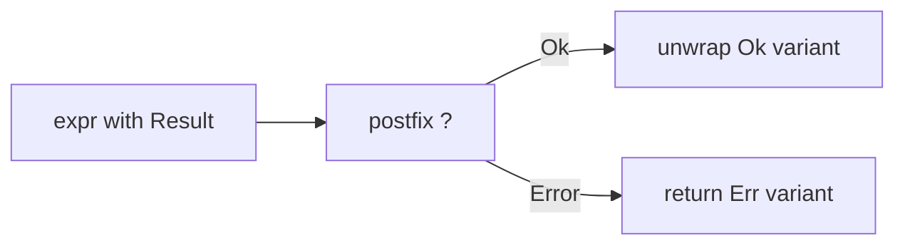

import SpecArticleChrome from '@beskid/beskid-ui/platform-spec/SpecArticleChrome.astro';

<SpecArticleChrome />

## Vocabulary

| Construct | Role |
| --- | --- |
| **`TryExpression`** | Postfix `expr?` operator for error propagation |
| **`Result<TValue, TError>`** | Corelib generic enum with `Ok` and `Error` variants |
| **`Option<T>`** | Corelib generic enum for absence (not failure) |

## Error propagation architecture

Beskid uses **explicit sum types** for recoverable errors. There is no `throw` keyword or exception mechanism in v0.1.

### Subsystem boundaries

| Subsystem | Responsibility | Key file |
| --- | --- | --- |
| Parser | Parse `expr?` as `TryExpression` | `syntax/expressions/try_expression.rs` |
| AST | Store try operator structure | `syntax/expressions/expression.rs` |
| Type checker | Validate try target is Result-shaped | `types/context/expressions.rs` |
| HIR lowering | Desugar `?` to branch sequences | `hir/normalize/expressions.rs` |
| Codegen | Emit branch instructions | `beskid_codegen` |

## `Result` vs `Option`

- `Result<TValue, TError>` models **recoverable failure**.
- `Option<T>` models **absence of value** (not failure).
- Do not conflate them.

## Postfix `?` only

Error propagation uses `expr?` only. There is no `try` statement form in v0.1.
