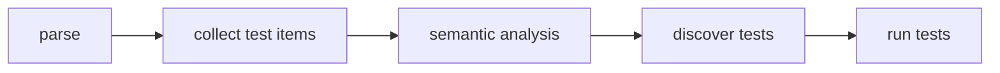

import SpecArticleChrome from '@beskid/beskid-ui/platform-spec/SpecArticleChrome.astro';

<SpecArticleChrome />

## Compile pipeline placement

## Test parsing algorithm (normative)

1. **Parse test item** — `test Name { body }` becomes `TestDefinition` with `name`, `meta`, `skip`, and `statements`.
2. **Parse meta section** — `meta { timeout = 30; }` becomes `TestMetaSection` with `TestMetadataEntry` items.
3. **Parse skip section** — `skip { condition = expr; }` becomes `TestSkipSection` with `TestMetadataEntry` items.
4. **Parse body statements** — Remaining items in the test body are parsed as `Statement` nodes with optional leading docs.
5. **Collect definitions** — `TestDefinition` nodes are collected alongside other items in the module.

## Discovery algorithm

1. **Filter by project kind** — `beskid test` scopes discovery to `Test` projects unless manifest policy allows otherwise.
2. **Walk module items** — Collect all `TestDefinition` nodes from parsed programs.
3. **Evaluate skip predicates** — For each test with a `skip` section, evaluate the predicate expression. If true, skip the test.
4. **Invoke in isolation** — The test runner invokes each discovered test entrypoint in isolation unless `meta` specifies shared fixtures (future).

## Execution model

- Failed assertions report as test failures without undefined behavior.
- Skipped tests do not count as failures when skip predicates evaluate true.
- Corelib testing helpers extend but do not redefine language-level `test` syntax.
