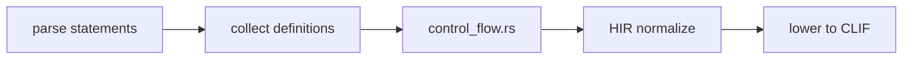

import SpecArticleChrome from '@beskid/beskid-ui/platform-spec/SpecArticleChrome.astro';

<SpecArticleChrome />

## Vocabulary

| Construct | Role |
| --- | --- |
| **`IfStatement`** | Conditional branch with mandatory `bool` condition |
| **`WhileStatement`** | Loop with pre-condition check |
| **`ForStatement`** | Iterator-driven loop (`for id in expr`) |
| **`ReturnStatement`** | Function exit with optional expression |
| **`BreakStatement`** | Exit innermost loop |
| **`ContinueStatement`** | Skip to next loop iteration |

## Control flow architecture

Control flow is **structured** — there is no `goto`. The compiler normalizes all control flow into a standard form during HIR lowering.

### Subsystem boundaries

| Subsystem | Responsibility | Key file |
| --- | --- | --- |
| Parser | Parse `if`, `while`, `for`, `return`, `break`, `continue` | `syntax/statements/` |
| AST | Store statement structure | `syntax/statements/statement.rs` |
| Control flow rules | Validate loop nesting, exhaustiveness | `analysis/rules/staged/control_flow.rs` |
| HIR normalize | Flatten to basic blocks | `hir/normalize/statements/` |
| Codegen | Emit branch instructions | `beskid_codegen` |

## Structured transfer only

`break` and `continue` must appear inside a loop. The compiler tracks loop nesting depth during semantic analysis and emits **E1401** or **E1402** for violations.

## Evaluation order

- Function arguments evaluate left to right before the call.
- Binary operators `&&` and `||` evaluate left operand before right with short-circuit semantics.
- Assignment evaluates the right-hand side before storing.
