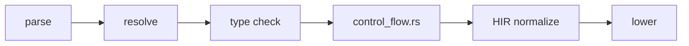

import SpecArticleChrome from '@beskid/beskid-ui/platform-spec/SpecArticleChrome.astro';

<SpecArticleChrome />

## Compile pipeline placement



## Control flow validation algorithm (normative)

1. **Parse statements** — `IfStatement`, `WhileStatement`, `ForStatement`, `ReturnStatement`, `BreakStatement`, `ContinueStatement` become AST nodes.
2. **Type-check conditions** — `if` and `while` conditions must be `bool`; `TypeNonBoolCondition` (**E1208**) otherwise.
3. **Check `for` iterability** — The `for` iterable must implement the iterable protocol; `TypeNonIterableForTarget` (**E1215**) otherwise.
4. **Validate loop nesting** — Track loop depth with a `HirWalker`. `BreakOutsideLoop` (**E1401**) and `ContinueOutsideLoop` (**E1402**) fire when transfer statements appear outside any loop.
5. **Check return paths** — Verify that `return` expressions match the function's declared return type; `TypeReturnMismatch` (**E1207**) otherwise.
6. **Detect unreachable code** — After unconditional `return`, `break`, or `continue`, subsequent statements are unreachable; `UnreachableCode` (**W1403**) warns.
7. **Normalize HIR** — Convert structured control flow to a graph of basic blocks. `NonNormalizedHirControlFlow` (**E1154**) fires if normalization fails.

## `for` loop lowering

The `for` statement desugars to iterator protocol calls:
1. Evaluate the iterable expression.
2. Call `Next()` on the iterator.
3. Check if the result is `Option.Some`.
4. Bind the payload to the loop variable.
5. Execute the body.
6. Repeat from step 2.

## HIR normalization

```mermaid
flowchart TB
    ifstmt[if (cond) { A } else { B }]
    block1[Block: evaluate cond]
    block2[Block: branch to A or B]
    block3[Block: A body]
    block4[Block: B body]
    block5[Block: merge]
    ifstmt --> block1 --> block2 --> block3 --> block5
    block2 --> block4 --> block5
```

## LSP / incremental

Re-run control flow analysis when statement structures, loop nesting, or return paths change.
