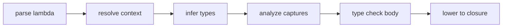
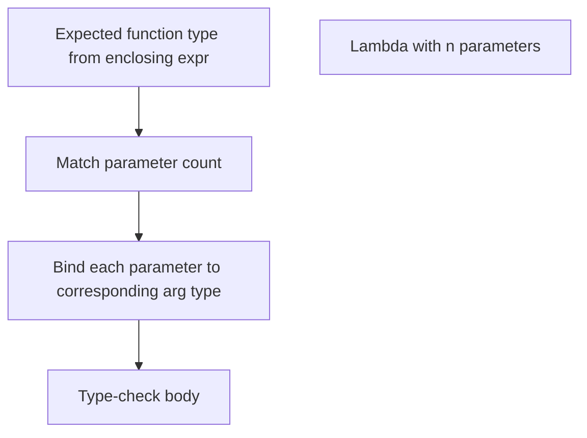

import SpecArticleChrome from '@beskid/beskid-ui/platform-spec/SpecArticleChrome.astro';

<SpecArticleChrome />

## Compile pipeline placement

## Lambda parsing algorithm (normative)

1. **Parse lambda expression** — `param => body` or `(p1, p2) => body` becomes `LambdaExpression` with `parameters` and `body`.
2. **Parse parameters** — Single identifier becomes an untyped parameter. Parenthesized list may include explicit types (`T name`).
3. **Infer parameter types** — If parameters lack types, infer from the expected function type in the surrounding expression context. `TypeMissingTypeAnnotation` (**E1202**) if inference fails.
4. **Type-check body** — Type-check the lambda body with the inferred/declared parameter types in scope.
5. **Analyze captures** — Identify locals referenced in the body that are defined in outer scopes.
6. **Validate capture rules** — Reject `mut` captures unless explicitly allowed. Check definite assignment.
7. **Lower to closure** — Build a closure environment object holding captured values. Heap-allocate if the closure escapes the frame.

## Contextual inference

## Closure environment layout

- **Stack closure** — Captures live on the stack if the closure does not escape the defining frame.
- **Heap closure** — Captures are moved to the GC heap if the closure escapes (for example, returned from a function or passed to `spawn`).

## LSP / incremental

Re-run lambda analysis when parameter types, body expressions, or capture contexts change.
