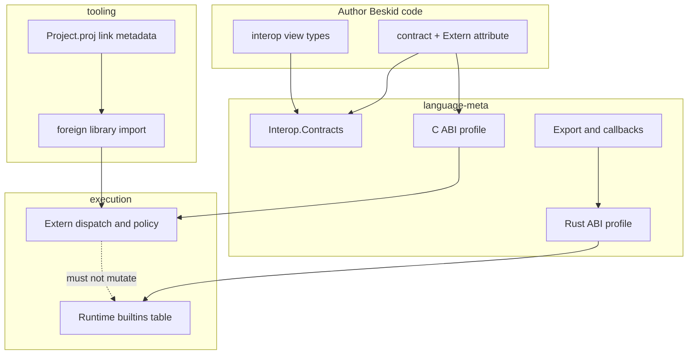

import SpecPageHeader from '@beskid/docs-ui/platform-spec/SpecPageHeader.astro';
import SpecSection from '@beskid/docs-ui/platform-spec/SpecSection.astro';
import DomainTiles from '@beskid/docs-ui/platform-spec/DomainTiles.astro';

<SpecPageHeader
	status="Standard"
	ownerName="Piotr Mikstacki"
	ownerEmail="pmikstacki@cybernomad.it"
	submitterName="Piotr Mikstacki"
	submitterEmail="pmikstacki@cybernomad.it"
/>

<SpecSection title="v0.3 scope" id="v03-scope">
**v0.3 FFI** finalizes normative platform contracts for **user interop and layout** at foreign boundaries. This pass is **spec-first**: reference compiler and CLI behavior may land in v0.3.x point releases after the text is stable.

**In scope for v0.3 Standard**

- **`Extern`** on **`contract`** declarations (import from C-compatible libraries).
- **Interop view types** (v0.3.0) for buffers and string-like data at the boundary.
- **Link-time** library binding as the conformance path for **Standard** tier-1 hosts.
- **[Export and callbacks](/platform-spec/language-meta/interop/export-and-callbacks/)** for embedding and plugin models.
- **Project `link` metadata** and **[foreign library import](/platform-spec/tooling/foreign-library-import/)** tooling.

**Out of scope or deferred**

- Changes to **`BESKID_RUNTIME_ABI_VERSION`** and the frozen runtime builtin export table — runtime embedding stays on the **[Rust ABI profile](/platform-spec/language-meta/interop/rust-abi-profile/)**.
- **`repr(C)` record types** on arbitrary Beskid types — **v0.3.1** (see **[C layout types](/platform-spec/language-meta/interop/c-abi-profile/c-layout-types/)**).
- **WinAPI / stdcall** as a **stdlib** concern — tier-1 **Standard** conformance does not require Windows user-extern linking in corelib; platform packages may document **Proposed** mappings separately.
- **Runtime `dlopen` resolution** — demoted to **[dynamic resolution profile](/platform-spec/language-meta/interop/c-abi-profile/dynamic-resolution-profile/)** (non-Standard appendix).
</SpecSection>

<SpecSection title="Profile boundary map" id="profile-boundary-map">



**Tier-1 rule:** user **`Extern`** libraries use **C ABI profile** + link-time binding. Runtime embedding and compiler builtins stay on **Rust ABI profile** / frozen `BESKID_RUNTIME_ABI_VERSION` — never mixed in the same symbol namespace.

</SpecSection>

<SpecSection title="What this feature specifies" id="what-this-feature-specifies">
This feature is the **canonical language-level** chapter for **foreign import** in Beskid: **`Extern`** metadata, **contract** import syntax, optional per-method **symbol** overrides, and how declarations connect to **[Interop.Contracts](/platform-spec/language-meta/interop/interop-contracts/)** and the **[C ABI profile](/platform-spec/language-meta/interop/c-abi-profile/)**.

Lowering tables, linker drivers, and syscall policy remain under **`/execution/`** and **[Extern dispatch and policy](/platform-spec/execution/abi-and-host/extern-dispatch-and-policy/)**; this hub owns **author-facing rules** only.
</SpecSection>

<SpecSection title="Placement of Extern" id="placement-of-extern">
The **`Extern`** attribute is a **contract-level** interop marker only. The reference compiler **must** reject **`Extern`** on non-contract declarations (diagnostic **E1510**).

**`Extern` on `mod`** is **not** part of v0.3 Standard; bulk C-header-style surfaces should use **`contract`** blocks with method signatures ending in **`;`**.

`Extern` supplies ABI and library metadata consumed when building **`ExternImport`** records during codegen (`compiler/crates/beskid_codegen/src/lowering/lowerable.rs`).
</SpecSection>

<SpecSection title="Formal attribute shape" id="formal-attribute-shape">
The platform reserves a built-in attribute declaration equivalent to:

```beskid
pub attribute Extern(ContractDeclaration) {
    Abi: string = "C",
    Library: string,
}
```

Contract methods may carry additional method-level attributes documented in **[extern attribute schema](./extern-attribute-schema/)** (for example **`Symbol`** overrides).
</SpecSection>

<SpecSection title="Safety and pointers" id="safety-and-pointers">
Unmanaged data crossing the boundary **must** use **interop view types** or primitives permitted by the active profile. Obligations for **borrow**, **transfer**, and **opaque handles** are normative under **[ownership at the boundary](/platform-spec/language-meta/interop/interop-contracts/ownership-at-boundary/)**.

Compiler mods do **not** gain ambient FFI unless the manifest grants **`extern_ffi`** — see **[mod host bridge FAQ](/platform-spec/compiler/compiler-mods/mod-host-bridge/faq-and-troubleshooting/)**.
</SpecSection>

<SpecSection title="Implementation anchors" id="implementation-anchors">
- Grammar: `compiler/crates/beskid_analysis/src/beskid.pest` (`contract`, `ContractMethodSignature`)
- AST: `compiler/crates/beskid_analysis/src/syntax/items/contract_definition.rs`
- Semantic validation: `compiler/crates/beskid_analysis/src/types/context/context.rs`
- Diagnostics: `compiler/crates/beskid_tests/src/analysis/diagnostics.rs` (**E1510**, extern type band)
- Codegen extern collection: `compiler/crates/beskid_codegen/src/lowering/lowerable.rs`, `compiler/crates/beskid_codegen/src/lowering/context.rs`
</SpecSection>

## Decisions

No open decisions. Closed choices are normative ADRs under **`adr/`** (`D-LMETA-FFI-0001` … `D-LMETA-FFI-0005`); use the reader **ADRs** tab for detail.

<DomainTiles pathPrefix="platform-spec/language-meta/interop/ffi-and-extern" heading="Articles" />
