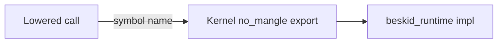
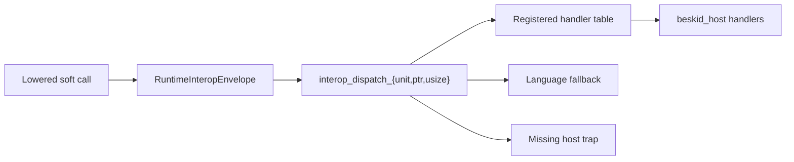

import SpecArticleChrome from '@beskid/beskid-ui/platform-spec/SpecArticleChrome.astro';

<SpecArticleChrome />

## Purpose

ABI v4 splits runtime entry into a **small language kernel**, **language-owned dispatch fallbacks**, and **host-owned dispatch handlers** registered by `beskid_host`. This article describes the call paths and the registration model after [D-EXEC-RT-0017](/platform-spec/language-meta/interop/rust-abi-profile/adr/0017-runtime-host-split-v4/).

## Direct kernel path

Hot, layout-sensitive, or bootstrap operations stay **direct**:

Examples: `alloc`, `gc_write_barrier`, `panic`, `panic_str`, `runtime_preempt_check`, `fiber_yield`, composition container lifecycle, dynamic mapping, dispatch entrypoints, registration entrypoints, and the ABI version export.

## Dispatch path

Soft ops emit a **`RuntimeInteropEnvelope`** and call the matching kernel dispatch builtin:

Codegen selects `interop_dispatch_unit`, `interop_dispatch_ptr`, or `interop_dispatch_usize` from the manifest return group. The runtime validates the tag and first checks the registered handler table. If no handler is registered, language-owned tags may fall back to static `beskid_runtime` builtins. Host-owned tags must not fall back to runtime builtins; they trap with a missing-host-handler diagnostic.

## Handler registration

Before user code runs in the `std` runtime profile:

1. The engine, runtime bridge, or AOT link anchor includes `beskid_host`.
2. Startup calls `beskid_host_register_all()`.
3. `beskid_host_register_all()` calls `beskid_register_handlers(4, table, count)` with FS/env/process/TTY handler entries.
4. User code may call host-owned dispatch surfaces through the same `System.*` facades.

The `minimal` profile links `beskid_runtime` only. In that profile, host-owned tags remain valid manifest tags but trap when used because no host handler table is registered.

Registration **must** complete before user static init ([D-EXEC-ABI-0008](/platform-spec/execution/abi-and-host/extern-dispatch-and-policy/adr/0007-handler-registration-init-order/)). Unknown tags must trap; known host tags without registration must trap deterministically.

## v4 kernel inventory

| Category | Symbols |
| --- | --- |
| Version | `beskid_runtime_abi_version` |
| Allocation / GC | `alloc`, `gc_write_barrier`, `gc_root_handle`, `gc_unroot_handle`, `gc_register_root`, `gc_unregister_root` |
| Faults / scheduling | `panic`, `panic_str`, `runtime_preempt_check`, `fiber_yield` |
| Dispatch | `interop_dispatch_unit`, `interop_dispatch_ptr`, `interop_dispatch_usize` |
| Registration | `beskid_register_callbacks`, `beskid_register_handlers` |
| Composition / dynamic | composition container lifecycle symbols; dynamic mapping symbols |

Language-owned dispatch remains in `beskid_runtime` for strings, bytes, arrays, GC status, fibers, channels, clocks, and `syscall_*`. Host-owned dispatch (`fs_*`, `env_*`, `process_*`, `tty_winsize`) is supplied by `beskid_host` in the `std` profile.

## Related topics

- [Runtime manifest](./runtime-manifest/) — schema, owners, and profiles
- [Boundary and stability](./boundary-and-stability/) — what loaders may rely on
- [Dispatch envelope layout](/platform-spec/language-meta/interop/interop-contracts/adr/0004-dispatch-envelope-layout/)
