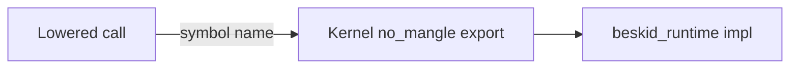

import SpecArticleChrome from '@beskid/beskid-ui/platform-spec/SpecArticleChrome.astro';

<SpecArticleChrome />

## Purpose

ABI v3 splits runtime entry into a **small kernel** of direct exports and **soft ops** routed through `interop_dispatch_*` builtins. This article describes the call paths and registration model.

## Direct kernel path

Hot, layout-sensitive, or bootstrap operations stay **direct**:



Examples: `alloc`, `gc_write_barrier`, `panic`, `runtime_preempt_check`, `fiber_yield`, composition container lifecycle, dynamic mapping (Phase A).

## Dispatch path

Soft ops emit a **`RuntimeInteropEnvelope`** and call the matching kernel dispatch builtin:

```mermaid
flowchart LR
  codegen[Lowered soft call]
  env[RuntimeInteropEnvelope]
  dispatch["interop_dispatch_{unit,ptr,usize}"]
  table[Handler table]
  impl[pub(crate) impl]
  codegen --> env --> dispatch --> table --> impl
```

Codegen selects `interop_dispatch_unit`, `interop_dispatch_ptr`, or `interop_dispatch_usize` from the manifest `return_group`. The runtime validates the tag (bitmap or table lookup) and delegates to the registered handler.

## Handler registration

Before user code runs:

1. Corelib `Runtime.Init` builds a compile-time handler table from manifest tags and `[Runtime]` attributes.
2. Init calls `beskid_register_handlers(version, table, count)`.
3. Static kernel handlers cover bootstrap; corelib registration fills soft-op slots.

Registration **must** complete before user static init ([D-EXEC-ABI-0008](/platform-spec/execution/abi-and-host/extern-dispatch-and-policy/adr/0007-handler-registration-init-order/)).

Unknown tags **must** trap — conformance tests cover every manifest tag.

## v3 kernel inventory (initial)

| Category | Symbols |
| --- | --- |
| Version | `beskid_runtime_abi_version` |
| Allocation / GC | `alloc`, `gc_write_barrier`, `gc_root_handle`, `gc_unroot_handle`, `gc_register_root`, `gc_unregister_root` |
| Faults / scheduling | `panic`, `panic_str`, `runtime_preempt_check`, `fiber_yield` |
| Dispatch | `interop_dispatch_unit`, `interop_dispatch_ptr`, `interop_dispatch_usize` |
| Registration | `beskid_register_callbacks`, `beskid_register_handlers` |
| Composition / dynamic | composition container lifecycle symbols; dynamic mapping symbols (direct until Phase D audit) |

All other manifest entries are dispatch-only in v3.

## Related topics

- [Runtime manifest](./runtime-manifest/) — schema and generation
- [Boundary and stability](./boundary-and-stability/) — what loaders may rely on
- [Dispatch envelope layout](/platform-spec/language-meta/interop/interop-contracts/adr/0004-dispatch-envelope-layout/)
