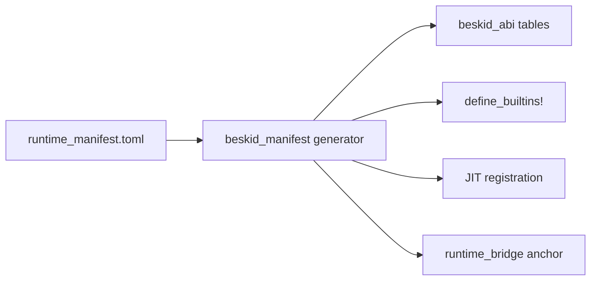

import SpecArticleChrome from '@beskid/beskid-ui/platform-spec/SpecArticleChrome.astro';

<SpecArticleChrome />

## Purpose

The **runtime manifest** (`compiler/runtime_manifest.toml`) is the language-owned catalog that classifies every runtime builtin as either a **kernel** direct export or a **dispatch** soft op. Rust registries are **generated** from this file — not edited by hand.

## Schema

Manifest rows use TOML tables grouped by role:

```toml
[[kernel]]
symbol = "alloc"
params = ["ptr", "ptr"]
returns = "ptr"
kind = "direct"

[[dispatch.usize]]
tag = 0
name = "StrLen"
beskid_path = ["__str_len"]
legacy_symbol = "str_len"
```

Each entry carries:

| Field | Meaning |
| --- | --- |
| `symbol` | Linker-visible name for kernel rows |
| `params` / `returns` | Cranelift ABI kinds |
| `beskid_path` | Compiler-visible `__*` path |
| `dispatch_tag` | Tag integer for soft ops |
| `return_group` | `unit`, `ptr`, `usize`, `i64`, or `direct` |
| `corelib_owner` | Optional corelib module owning the Beskid shim |
| `legacy_symbol` | v2 direct export name (removed from kernel in v3) |

## Generation pipeline



`beskid_abi` `build.rs` runs the generator and writes:

- `src/generated/builtins.rs` — `BUILTIN_SPECS`
- `src/generated/symbols.rs` — `RUNTIME_EXPORT_SYMBOLS`, `SYM_*`
- Analysis, JIT, and bridge stubs in their respective crates

`cargo:rerun-if-changed=runtime_manifest.toml` keeps outputs in sync.

## Ownership

| Owner | Responsibility |
| --- | --- |
| **Language / platform spec** | Manifest schema, kernel inventory, tag assignment policy |
| **Corelib** | `[Runtime]` attributes and `Runtime.Abi` constants that mirror manifest tags |
| **Generator** | Mechanical emission — no business logic |
| **Runtime crate** | Private implementations; kernel exports and dispatch handlers only |

Normative decision: [D-LMETA-RUSTABI-0004](/platform-spec/language-meta/interop/rust-abi-profile/adr/0004-language-owned-runtime-manifest/).

## Related topics

- [Kernel and dispatch](./kernel-and-dispatch/) — call paths after generation
- [Manifest-generated registries](/platform-spec/execution/abi-and-host/builtins-and-symbols/adr/0005-manifest-generated-registries/) — execution-side registry rules
