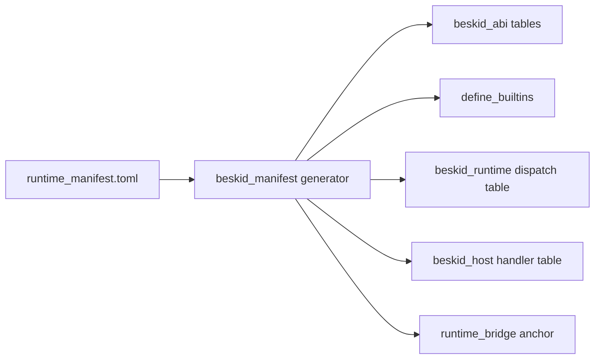

import SpecArticleChrome from '@beskid/beskid-ui/platform-spec/SpecArticleChrome.astro';

<SpecArticleChrome />

## Purpose

The **runtime manifest** (`compiler/runtime_manifest.toml`) is the language-owned catalog that classifies every runtime builtin as a **kernel** direct export or a **dispatch** soft op. ABI v4 also classifies every dispatch row by runtime authority: **language** or **host**.

Rust registries are **generated** from this file — not edited by hand.

## Schema

Manifest rows use TOML tables grouped by role:

```toml
[manifest]
abi_version = 4

[profiles.minimal]
owners = ["language"]

[profiles.std]
owners = ["language", "host"]

[[kernel]]
symbol = "alloc"
params = ["usize", "ptr"]
returns = "ptr"
injected = true
beskid_path = ["__alloc"]

[[dispatch.usize]]
tag = 0
name = "StrLen"
beskid_path = ["__str_len"]
dispatch_key = "str_len"
owner = "language"

[[dispatch.usize]]
tag = 1
name = "FsWriteText"
beskid_path = ["__fs_write_text"]
dispatch_key = "fs_write_text"
owner = "host"
```

Each entry carries:

| Field | Meaning |
| --- | --- |
| `symbol` | Linker-visible name for kernel rows |
| `params` / `returns` | Cranelift ABI kinds |
| `beskid_path` | Compiler-visible `__*` path |
| `tag` | Tag integer for dispatch rows |
| `return_group` | The dispatch table group: `unit`, `ptr`, `usize`, or `i64` |
| `dispatch_key` | Stable routing key for generated lookup tables and handler wrappers (not a kernel export) |
| `owner` | Dispatch authority: `language` or `host` |
| `injected` | Whether the compiler injects the Beskid `__*` path |

## Runtime profiles

| Profile | Owners | Behavior |
| --- | --- | --- |
| `minimal` | `language` | Links `beskid_runtime` only. Language-owned dispatch has runtime fallback; host-owned tags trap if called. |
| `std` | `language`, `host` | Links `beskid_runtime` plus `beskid_host`. Host-owned tags are registered before user entry. |

The CLI defaults to `std`. `--runtime-profile minimal` exists for testing and host-less programs that do not use FS/env/process/TTY surfaces.

## Ownership

| Owner | Responsibility |
| --- | --- |
| **Language / platform spec** | Manifest schema, kernel inventory, tag assignment policy, profile semantics |
| **Generator** | Mechanical emission — no business logic outside manifest classification |
| **Runtime crate** | Kernel exports, dispatch router, and static fallback for language-owned dispatch |
| **Host crate** | FS/env/process/TTY dispatch handlers and `beskid_host_register_all()` |
| **Corelib** | Public `System.*` facades and `Runtime.Abi` constants that mirror manifest tags |

Host-owned dispatch rows in ABI v4 are `fs_write_text`, `fs_read_text`, `fs_delete`, `fs_exists`, `fs_mkdir`, `env_get`, `env_getcwd`, `env_set`, `process_exit`, `process_getpid`, and `tty_winsize`.

`syscall_*`, clocks, fibers, channels, strings, bytes, arrays, GC status, events, mutexes, hubs, and wait groups remain language-owned.

## Generation pipeline



`beskid_abi` `build.rs` runs the generator and writes:

- `src/generated/builtins.rs` — `BUILTIN_SPECS`
- `src/generated/symbols.rs` — `RUNTIME_EXPORT_SYMBOLS`, `SYM_*`
- dispatch lookup and tag tables consumed by compiler and tests
- runtime dispatch tables with language fallback only
- host-handler tables consumed by `beskid_host`
- analysis, JIT, and bridge stubs in their respective crates

`cargo:rerun-if-changed=runtime_manifest.toml` keeps outputs in sync.

Normative decisions: [D-LMETA-RUSTABI-0004](/platform-spec/language-meta/interop/rust-abi-profile/adr/0004-language-owned-runtime-manifest/) and [D-EXEC-RT-0017](/platform-spec/language-meta/interop/rust-abi-profile/adr/0017-runtime-host-split-v4/).

## Related topics

- [Kernel and dispatch](./kernel-and-dispatch/) — call paths after generation
- [Manifest-generated registries](/platform-spec/execution/abi-and-host/builtins-and-symbols/adr/0005-manifest-generated-registries/) — execution-side registry rules
