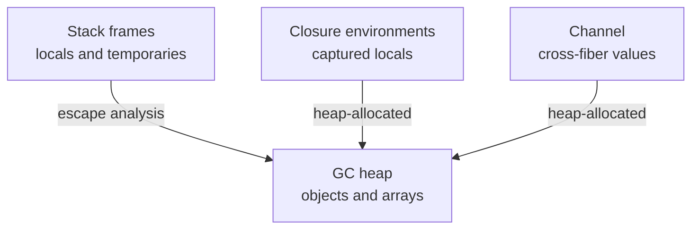

import SpecArticleChrome from '@beskid/beskid-ui/platform-spec/SpecArticleChrome.astro';

<SpecArticleChrome />

## Vocabulary

| Construct | Role |
| --- | --- |
| **`mut T name`** | Mutable binding (prefix modifier before type) |
| **`let mut name`** | Mutable inferred local |
| **`BeskidArray`** | Fat-pointer layout for array values |
| **GC heap** | Collector-managed storage for escaped reference-bearing values |

## Memory architecture

Beskid uses a **concurrent tri-color mark-sweep GC** in the reference implementation. User code cannot manually free heap objects.

### Subsystem boundaries

| Subsystem | Responsibility | Key file |
| --- | --- | --- |
| Parser | Parse prefix `mut` on bindings | `beskid.pest` |
| Type checker | Validate `mut` reassignment rules | `types/context/` |
| Semantic rules | Immutable assignment check | `analysis/rules/staged/` |
| Runtime | GC and heap management | `beskid_runtime/src/gc.rs` |
| Codegen | Emit write barriers | `beskid_codegen` |

## Local storage

Locals live in function activation records unless captured by closures. Assignment to immutable bindings emits **E1214**.

## `mut` bindings

- Typed locals and parameters use `mut` before the type: `mut i64 acc = 0`, `fn f(mut u8[] buf)`.
- Inferred locals use `let mut name = expr`.
- Parameters pass by value; mutation of caller state uses return values or heap/`T[]` handles.

## Arrays

`T[]` values use the fat-pointer layout (`BeskidArray`). Element access respects bounds checks in safe builds.

## Cross-fiber sharing

Values must not be shared across fibers by alias unless immutability is proven or synchronization uses `Channel<T>`.
