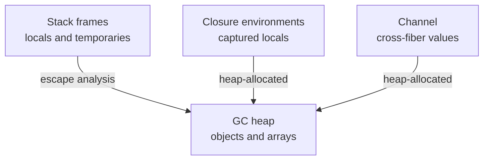

import SpecArticleChrome from '@beskid/beskid-ui/platform-spec/SpecArticleChrome.astro';

<SpecArticleChrome />

## Vocabulary

| Construct | Role |
| --- | --- |
| **`ref T`** | By-reference parameter passing mode |
| **`out T`** | Output parameter requiring definite assignment |
| **`BeskidArray`** | Fat-pointer layout for array values |
| **GC heap** | Collector-managed storage for escaped reference-bearing values |

## Memory architecture

Beskid uses a **concurrent tri-color mark-sweep GC** in the reference implementation. User code cannot manually free heap objects.

### Subsystem boundaries

| Subsystem | Responsibility | Key file |
| --- | --- | --- |
| Parser | Parse `ref`/`out` modifiers | `beskid.pest` |
| Type checker | Validate `ref` usage | `types/context/` |
| Semantic rules | Immutable assignment check | `analysis/rules/staged/` |
| Runtime | GC and heap management | `beskid_runtime/src/gc.rs` |
| Codegen | Emit write barriers | `beskid_codegen` |

## Local storage

Locals live in function activation records unless captured by closures. Assignment to immutable bindings emits **E1214**.

## `ref` and `out`

- `ref` passes an alias to existing storage.
- `out` requires definite assignment before read on callee entry.
- Both appear only in parameter signatures; `ref T` in type expressions denotes reference types in signatures distinct from by-value `T`.

## Arrays

`T[]` values use the fat-pointer layout (`BeskidArray`). Element access respects bounds checks in safe builds.

## Cross-fiber sharing

Values must not be shared across fibers by alias unless immutability is proven or synchronization uses `Channel<T>`.
