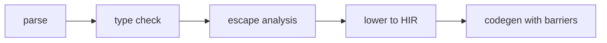

import SpecArticleChrome from '@beskid/beskid-ui/platform-spec/SpecArticleChrome.astro';

<SpecArticleChrome />

## Compile pipeline placement

## Memory validation algorithm (normative)

1. **Parse declarations** — `ref`/`out` modifiers become `ParameterModifier` nodes.
2. **Type-check references** — `ref T` is valid in signatures; invalid in value positions.
3. **Check immutability** — `ImmutableAssignment` (**E1214**) fires when assigning to an immutable binding.
4. **Escape analysis** — Identify reference-bearing values that escape their defining frame.
5. **Heap allocation decision** — Escaped values must live on the GC heap.
6. **Insert write barriers** — Pointer stores to heap objects execute write barriers when required by the active GC phase.
7. **Bounds checks** — Array element access inserts bounds checks in safe builds unless proven safe.

## GC phases

The reference implementation uses concurrent tri-color mark-sweep:
1. **Mark** — Trace reachable objects from roots.
2. **Sweep** — Reclaim unreachable objects.
3. **Write barriers** — During mark, pointer stores trigger barrier logic to preserve the tri-color invariant.

## Cross-fiber sharing rules

1. **No alias sharing** — Values must not be shared across fibers by alias.
2. **Immutability exception** — Immutable values may be shared without synchronization.
3. **Channel required** — Mutable shared state must use `Channel<T>`.
4. **Spawn closure check** — `StackReferenceEscapesSpawn` (**E1225**) prevents unsafe captures.

## LSP / incremental

Re-run memory analysis when local declarations, assignments, or closure captures change.
