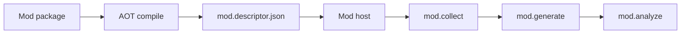

import SpecArticleChrome from '@beskid/beskid-ui/platform-spec/SpecArticleChrome.astro';

<SpecArticleChrome />

## Vocabulary

| Construct | Role |
| --- | --- |
| **`Collector`** | Declarative target collection and scope narrowing |
| **`Generator`** | Incremental typed AST emission |
| **`Analyzer`** | Diagnostic emission and rewrite registration |
| **`Rewriter`** | AST node replacement |
| **`AttributeGenerator`** | Attribute definition for mod packages |
| **`GrammarGenerator`** | Registers `.pest` roots; Beskid `Core.Text.Pest` emit + mod scheduling materialize combinator parsers |
| **`NodeRef`** | Stable syntax node handle `{ syntaxGenerationId, nodeId }` |

## Mod SDK architecture

The Compiler Mod SDK is the Beskid-side surface for `type: Mod` projects. Mod behavior is declared through contracts and `Beskid.Syntax` operations.



### Subsystem boundaries

| Subsystem | Responsibility | Key file |
| --- | --- | --- |
| Mod author | Write contract implementations | Mod project sources |
| AOT compile | Build mod artifact | `beskid build` |
| Mod host | Load and schedule mods | `beskid_analysis/src/mod_host/` |
| Discovery | Read `mod.descriptor.json` | `mod_host/discovery.rs` |
| Execution | Run collect/generate/analyze | `mod_host/invoker.rs` |

## Contract hierarchy

| Contract | Role |
| --- | --- |
| `Collector` | Target collection and scope narrowing |
| `Generator` | Incremental typed AST emission |
| `Analyzer` | Diagnostics and rewrites |
| `Rewriter<TSource, TTarget>` | Node replacement |
| `AttributeGenerator` | Attribute definitions |
| `GrammarGenerator` | Pest grammar discovery and combinator codegen ([Pest parser generator](/platform-spec/compiler/compiler-mods/pest-parser-generator/)) |

### `GrammarGenerator` contract

Grammar mods implement **`Beskid.Compiler.Collect.GrammarGenerator`**. The contract lives in **`Beskid.Compiler.Collect`** alongside `Collector` and follows the same request payload shape as `Generator`.

```beskid
pub contract GrammarGenerator {
    GeneratedSyntaxContribution Generate(GenerationRequest request);
}
```

| Field | Role |
| --- | --- |
| `request.context` | `CollectRequest` — active compilation, workspace, mod catalog |
| `request.targets` | `CollectTargetSet` from the paired `Collector` registration (Pest file paths, grammar output bindings) |

The host **must** register contract types whose symbol suffix is **`.GrammarGenerator`** in mod descriptor discovery. On fingerprint miss, the host invokes `Generate`, merges the returned `GeneratedSyntaxContribution`, and **may** write emitted sources under **`.generated/{modulePath}/{fileName}.g.bd`** in the consumer package (layout schema v2: `fileName` + `modulePath` + optional `packageId`). Emitted parsers **must** call **`Core.Text.Parser`** combinators only and satisfy **PARSER-005** naming.

### `GeneratedSyntaxContribution` (typed + code outputs)

```beskid
pub type GeneratedSyntaxContribution {
    SyntaxContributionItem[] items,   // legacy typed merge path
    CodeContribution[] codeOutputs,   // primary generator emit path
}

pub type CodeContribution {
    string modulePath,
    string fileName,
    CodeString body,                  // fenced Beskid source; host evaluates `@{}` holes
}
```

`Beskid.Compiler.Emitter.Contribution` helpers assemble contributions (`FromCodeOutputs`, `AppendCode`, …). **`ContributionFluent`** is removed—generators use plain contribution builders.

Reference implementation: `corelib_pest_gen` (`PestCollector` + `PestGen`). Consumer projects declare inputs via the **`grammar { }`** block ([project manifest contract](/platform-spec/tooling/manifests-and-lockfiles/project-manifest-contract/)).

## Beskid.Syntax

- `Beskid.Syntax.Nodes.Node` is a contract (not a variant enum) for mod traversal.
- `NodeRef` handles provide stable identities per syntax generation.
- Concrete mirrored types (`FunctionDefinition`, `Expression`, ...) remain for typed construction.
- No string formatting or source-text emission.

## Compilation context modules

Mods receive **workspace and compilation context** through request payloads marshaled by the host bridge. These modules are Beskid-authored; Rust mirrors them via `compiler_sdk_reflect.rs`.

| Module | Purpose |
| --- | --- |
| **`Beskid.Compiler.Workspace`** | Root path, member projects, lock hash, resolved mod dependency graph |
| **`Beskid.Compiler.Compilation`** | Active project, `CompilePlan` summary, target triple, `syntaxGenerationId`, entry source |
| **`Beskid.Compiler.ModCatalog`** | Loaded mods: `packageId`, version, capabilities, registrations, descriptor paths |
| **`Beskid.Compiler.ModPackage`** | Single mod view: contract surface introspection (`contractId`, `typeId`, `entrySymbol`) |

`Beskid.Compiler.Compilation` remains the handle for the active host compilation instance; the modules above populate structured fields on collect/generate requests rather than ad hoc host APIs.

## Request payloads

`Collector` and `Generator` contracts receive populated context—not empty stub records.

```beskid
pub type CollectRequest {
    Beskid.Compiler.Compilation compilation,
    Beskid.Compiler.Workspace workspace,
    Beskid.Compiler.ModCatalog mods,
}

pub type GenerationRequest {
    CollectRequest context,
    CollectTargetSet targets,
}
```

| Request | When populated | Contents |
| --- | --- | --- |
| **`CollectRequest`** | **`mod.collect`** | Active compilation, workspace slice, and catalog of loaded mod packages |
| **`GenerationRequest`** | **`mod.generate`** | Same context plus the `CollectTargetSet` returned by the matching `Collector` registration |

The host **must** populate these types from `ModHostInput`, `CompilePlan`, and loaded mod descriptors before invoking contract entry symbols. Mods use context to implement workspace-wide logic (for example: enumerate fluent-annotated types across members, or list `Generator` registrations from sibling mods) without per-use-case Rust bridge extensions.
