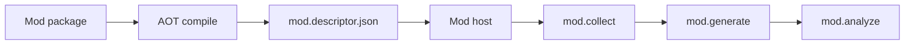

import SpecArticleChrome from '@beskid/beskid-ui/platform-spec/SpecArticleChrome.astro';

<SpecArticleChrome />

## Vocabulary

| Construct | Role |
| --- | --- |
| **`Collector`** | Declarative target collection and scope narrowing |
| **`Generator`** | Incremental typed AST emission |
| **`Analyzer`** | Diagnostic emission and rewrite registration |
| **`Rewriter`** | AST node replacement |
| **`AttributeGenerator`** | Attribute definition for mod packages |
| **`GrammarGenerator`** | Registers `.pest` roots; host `beskid_pest_gen` emits combinator parsers |
| **`NodeRef`** | Stable syntax node handle `{ syntaxGenerationId, nodeId }` |

## Mod SDK architecture

The Compiler Mod SDK is the Beskid-side surface for `type: Mod` projects. Mod behavior is declared through contracts and `Beskid.Syntax` operations.

### Subsystem boundaries

| Subsystem | Responsibility | Key file |
| --- | --- | --- |
| Mod author | Write contract implementations | Mod project sources |
| AOT compile | Build mod artifact | `beskid build` |
| Mod host | Load and schedule mods | `beskid_analysis/src/mod_host/` |
| Discovery | Read `mod.descriptor.json` | `mod_host/discovery.rs` |
| Execution | Run collect/generate/analyze | `mod_host/invoker.rs` |

## Contract hierarchy

| Contract | Role |
| --- | --- |
| `Collector` | Target collection and scope narrowing |
| `Generator` | Incremental typed AST emission |
| `Analyzer` | Diagnostics and rewrites |
| `Rewriter<TSource, TTarget>` | Node replacement |
| `AttributeGenerator` | Attribute definitions |
| `GrammarGenerator` | Pest grammar discovery and combinator codegen ([Pest parser generator](/platform-spec/compiler/compiler-mods/pest-parser-generator/)) |

## Beskid.Syntax

- `Beskid.Syntax.Nodes.Node` is a contract (not a variant enum) for mod traversal.
- `NodeRef` handles provide stable identities per syntax generation.
- Concrete mirrored types (`FunctionDefinition`, `Expression`, ...) remain for typed construction.
- No string formatting or source-text emission.
