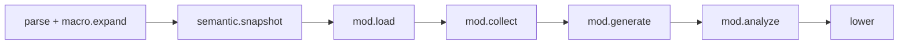

import SpecArticleChrome from '@beskid/beskid-ui/platform-spec/SpecArticleChrome.astro';

<SpecArticleChrome />

## Compile pipeline placement

## Mod discovery algorithm (normative)

1. **Resolve dependencies** — Find every transitive `type: Mod` dependency from the host `CompilePlan`.
2. **Locate AOT artifact** — Find the artifact for the active target triple and cache key.
3. **Read descriptor** — Parse `mod.descriptor.json` and/or native object export table.
4. **Build schedule** — Create `(contractId, typeId, entrySymbol)` tuples.
5. **Detect conflicts** — Duplicate or conflicting registrations emit **E1829** / **E1851–E1870**.
6. **Execute collect** — Run `Collector` contracts to narrow targets.
7. **Execute generate** — Run `Generator` contracts; host re-parses and merges contributions (bounded by `maxGeneratorRounds`).
8. **Execute analyze** — Run `Analyzer` contracts on merged program (including generated code).
9. **Apply rewrites** — Run `Rewriter` contracts when an analyzer declares a fix.

## Pipeline interaction

From a mod author's perspective:
1. **Collect** — `Collector` narrows targets.
2. **Generate** — `Generator` contributes typed AST; host re-parses and merges.
3. **Analyze** — `Analyzer` runs after semantic snapshot on merged program.
4. **Rewrite** — `Rewriter` applies when an analyzer declares a fix.

## LSP / incremental

Re-run mod phases when mod artifacts, generated code, or host source changes.
