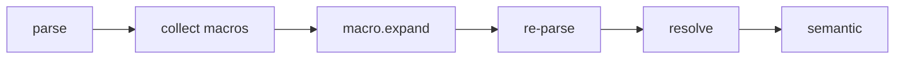

import SpecArticleChrome from '@beskid/beskid-ui/platform-spec/SpecArticleChrome.astro';

<SpecArticleChrome />

## Compile pipeline placement

## Macro expansion algorithm (normative)

1. **Parse macro definitions** — `MacroDefinition` stores `name`, `parameters` (kind + name), and `body`.
2. **Build registry** — `MacroRegistry::from_program()` walks items and collects `MacroDefinition` nodes. `MacroAmbiguousName` (**E1907**) for duplicates. `MacroDuplicateParameter` (**E1908**) for duplicate parameter names.
3. **Parse invocations** — `name!(args)` or `name! { block }` becomes `MacroInvocation`.
4. **Resolve invocation** — Look up the macro name in `MacroRegistry`. `MacroUnknown` (**E1901**) if not found.
5. **Validate arity** — Compare actual argument count to parameter count. `MacroArgumentArityMismatch` (**E1902**) if they differ.
6. **Validate fragment kinds** — Match each actual argument shape against the declared parameter kind. `MacroArgumentKindMismatch` (**E1903**) for mismatches.
7. **Substitute** — Deep-copy each captured fragment and substitute for every `$param` occurrence in the macro body.
8. **Splice** — Replace the `MacroInvocation` with the expanded statements or expression.
9. **Repeat** — Continue expanding until no `!` invocations remain or depth cap is reached. `MacroExpansionDepthExceeded` (**E1905**) at cap.
10. **Re-parse and re-resolve** — Expanded trees must pass the same structural checks as authored syntax.

## Mod interaction

After `mod.generate` merges typed contributions and the host re-parses, `macro.expand` runs again inside the generator replay loop so mod-emitted code can contain macro invocations.

## LSP / incremental

Re-run macro expansion when macro definitions or invocations change.
