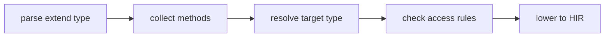

import SpecArticleChrome from '@beskid/beskid-ui/platform-spec/SpecArticleChrome.astro';

<SpecArticleChrome />

## Vocabulary

| Construct | Role |
| --- | --- |
| **`ExtendTypeDefinition`** | `extend type T { methods }` block |
| **`MethodDefinition`** | Callable member with optional receiver type |
| **`ReceiverType`** | Type parsed as the extension target |

## Extension architecture

`extend type` is the normative mechanism for adding members to an existing type. It replaces prior `impl` block patterns.

### Subsystem boundaries

| Subsystem | Responsibility | Key file |
| --- | --- | --- |
| Parser | Parse `extend type` and methods | `syntax/items/extend_type.rs` |
| AST | Store extension structure | `syntax/items/extend_type.rs` |
| Resolver | Index extended methods under target type | `resolve/member_items.rs` |
| Visibility | Check private member access | `analysis/rules/staged/visibility.rs` |
| HIR lowering | Normalize method definitions | `hir/lowering/items.rs` |

## Access rules

- Members inside `extend type` may access public members of the extended type only.
- Private member access is forbidden inside `extend type` bodies.
- `extend type` does not bypass module visibility; extension sites must satisfy normal import and visibility rules.

## Compiler mod integration

`Generator` contracts may emit `extend type` blocks as typed AST contributions. Generated extensions follow the same access and visibility rules as hand-authored extensions.
