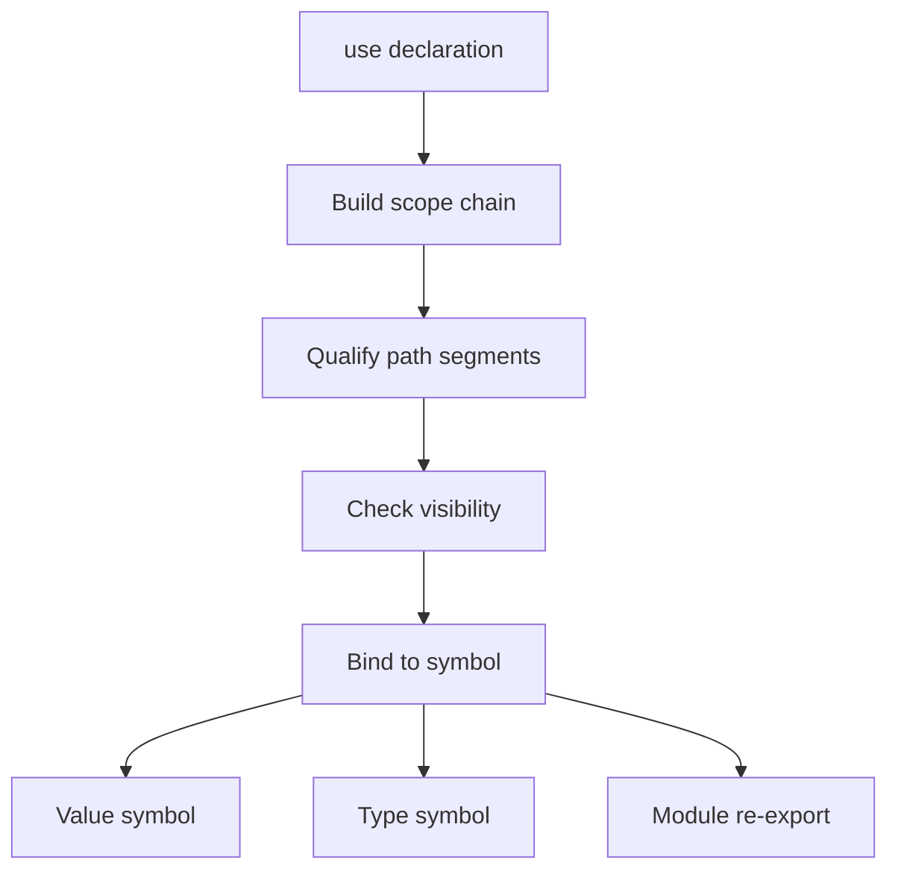

import SpecPageHeader from '@beskid/docs-ui/platform-spec/SpecPageHeader.astro';
import SpecSection from '@beskid/docs-ui/platform-spec/SpecSection.astro';

<SpecPageHeader
	status="Standard"
	ownerName="Piotr Mikstacki"
	ownerEmail="pmikstacki@cybernomad.it"
	submitterName="Piotr Mikstacki"
	submitterEmail="pmikstacki@cybernomad.it"
/>

## Resolution flow

## Normative specification

### Scope

Defines how **identifiers** and **paths** bind to program items across modules. Module shape is in [Modules and visibility](/platform-spec/language-meta/program-structure/modules-and-visibility/).

### `use` declarations

- **`use Path;`** imports the final segment into the current scope.
- **`use Path as Alias;`** binds the resolved target to `Alias`.
- **`use` before declaration** in the same module **must** error (**E1106**) when forward reference is illegal.
- Unknown import paths **must** error (**E1105**); ambiguous imports **must** error (**E1104**).

### Value and type paths

- **Value paths** resolve to functions, locals, constants, enum constructors, and contract namespaces.
- **Type paths** resolve to types, generics, and primitive names.
- Unresolved value **E1101**; unresolved type **E1201**; unknown module segment **E1108**.

### Locals and shadowing

- Inner scopes **may** shadow outer locals; shadowing **should** warn (**W1103**).
- Duplicate definitions in the same scope **must** error (**E1006**, **E1102**).

### Static rules

- Resolution **must** respect visibility from the importer’s module.
- Generic parameters shadow type names in signature scope only for the declaring signature.

### Dynamic semantics

Resolution is compile-time; emitted metadata records stable `qualifiedName` strings for tooling.

### Diagnostics

Import band **E1104–E1108**; resolve duplicates **E1102**. Registry: [Diagnostic code registry](/platform-spec/compiler/semantic-pipeline/diagnostic-code-registry/).

### Conformance

**L1** resolver tests **must** pass for cross-module `use` and private item rejection.

## Decisions

- **D-LM-NAME-001 — Single resolver graph:** Package driver and typechecker share one resolution snapshot per compilation.
- **D-LM-NAME-002 — Contract namespaces:** Contracts may appear as path prefixes for static methods without a separate `use` import of each method.
- **D-LM-NAME-003 — Qualified names for tooling:** Emitted `qualifiedName` strings **must** be stable across compiles for the same source snapshot.
- **D-LM-NAME-004 — No implicit `null` imports:** Resolution **must not** inject nullable or `optional` aliases.

## Platform view

Scopes, imports, and shadowing tie syntax to symbols. Diagnostics for unresolved names must cite these rules verbatim.
