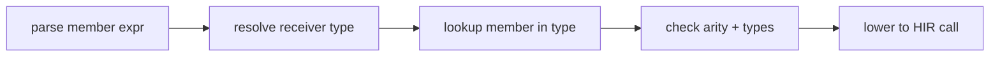

import SpecArticleChrome from '@beskid/beskid-ui/platform-spec/SpecArticleChrome.astro';

<SpecArticleChrome />

## Vocabulary

| Construct | Role |
| --- | --- |
| **`MemberExpression`** | Postfix `.Identifier` access on a receiver value |
| **`MethodDefinition`** | Callable member declared in `type` or `extend type` |
| **`ReceiverType`** | Static type of the expression before the dot |
| **`extend type`** | External member addition to an existing type |

## Dispatch architecture

Beskid v0.1 uses **static dispatch** — the callee is known at compile time from the receiver's static type. There is no virtual table polymorphism for user classes unless introduced by a future decision.

### Subsystem boundaries

| Subsystem | Responsibility | Key file |
| --- | --- | --- |
| Parser | Parse `receiver.method()` syntax | `syntax/expressions/member_expression.rs` |
| Resolver | Bind member names to definitions | `resolve/member_items.rs` |
| Type checker | Validate receiver type and argument types | `types/context/expressions.rs` |
| HIR lowering | Normalize to direct call | `hir/lowering/expressions.rs` |
| Codegen | Emit static call instruction | `beskid_codegen` |

## Receiver rules

- Instance calls use postfix `.Identifier` after a primary expression.
- The receiver's static type must expose a callable member with matching name and signature.
- `extend type` members participate in the member set with the same visibility rules as declared members.

## Overload resolution (v0.1)

Overloading is resolved by arity and argument types at the call site. There is no ad hoc ranking beyond signature match. Ambiguous overload sets emit **E1204** or **E1205** rather than picking a candidate.
