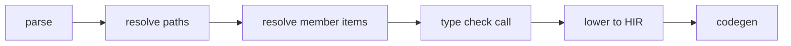

import SpecArticleChrome from '@beskid/beskid-ui/platform-spec/SpecArticleChrome.astro';

<SpecArticleChrome />

## Compile pipeline placement

## Member resolution algorithm (normative)

1. **Parse member expression** — `receiver.method(args)` becomes `MemberExpression` + `CallExpression`.
2. **Resolve receiver type** — Type-check the receiver expression to get its static type.
3. **Lookup member** — Search the type's member set (declared + `extend type`) for a matching name.
4. **Check visibility** — Verify the member is accessible from the call site; `ResolvePrivateItemInModule` (**E1107**) otherwise.
5. **Match signature** — Compare argument count and types against the method signature.
6. **Emit mismatch diagnostics** — `TypeCallArityMismatch` (**E1204**) or `TypeCallArgumentMismatch` (**E1205**) if arguments do not match.
7. **Lower to HIR** — Replace member call with a direct function call to the resolved method.

## `extend type` participation

`extend type` blocks add methods to the extended type's member set:
1. During definition collection, `extend type` methods are indexed under the target type.
2. Member lookup includes both declared and extended methods.
3. `ExtendTypePrivateMemberAccess` (**E1511**) prevents access to private members of the extended type from within `extend type`.

## Contract namespace calls

Contracts may be used as namespaces for static-style calls (`Contract.method()`). The resolver falls back to contract-as-namespace when a direct value binding is not found.

## LSP / incremental

Re-run member resolution when type definitions, `extend type` blocks, or method signatures change.
