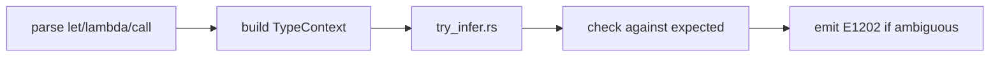

import SpecArticleChrome from '@beskid/beskid-ui/platform-spec/SpecArticleChrome.astro';

<SpecArticleChrome />

## Vocabulary

| Construct | Role |
| --- | --- |
| **`TypedLet`** | `let name = expr` where the variable type is inferred from the initializer |
| **`ExplicitLet`** | `let T name = expr` where the type is written by the author |
| **`TypeContext`** | Central type-checking state holding symbol tables and inference results |
| **`try_infer`** | Local inference routine for unannotated bindings |

## Inference architecture

Type inference in Beskid is **local and context-driven**, not global Hindley-Milner. The compiler infers types at specific sites where the expected type is unambiguous.

### Inference sites

1. **`let name = expr`** — Infer variable type from `expr` type when unambiguous.
2. **Function return types** — When omitted, inference may use body yield rules; explicit annotation is recommended for public APIs.
3. **Generic arguments at call sites** — Inferred from parameter types when a unique solution exists.
4. **Lambda parameters** — Inferred from expected function type; untyped parameters require contextual type.

### Subsystem boundaries

| Subsystem | Responsibility | Key file |
| --- | --- | --- |
| Parser | Distinguish `let` from typed `let` | `beskid.pest` |
| AST | Store binding shapes | `syntax/expressions/` |
| Type context | Resolve expression types | `types/context/expressions.rs` |
| Inference | Fill missing annotations | `types/context/try_infer.rs` |
| Semantic rules | Emit ambiguity errors | `analysis/rules/staged/type_checking.rs` |

## Fail-on-ambiguity model

When multiple types satisfy constraints, the compiler emits **E1202** (missing annotation) rather than guessing. This is locked by decision **D-LM-INF-001**.

## No implicit widening

Inference does not widen beyond declared or inferred constraints. There is no implicit numeric promotion across unrelated primitives in v0.1. `TypeImplicitNumericCast` (**W1203**) warns when a narrowing cast is detected.
