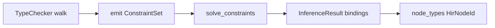

import SpecArticleChrome from '@beskid/beskid-ui/platform-spec/SpecArticleChrome.astro';

<SpecArticleChrome />

## Vocabulary

| Construct | Role |
| --- | --- |
| **`TypedLet`** | `let name = expr` where the variable type is inferred from the initializer |
| **`ExplicitLet`** | `let T name = expr` where the type is written by the author |
| **`TypeVar`** | Inference metavariable introduced during body typing |
| **`ConstraintSet`** | Collected equality and kind constraints for one inference site |
| **`InferenceResult`** | Solved `TypeVar → TypeId` bindings from the constraint solver |
| **`TypeChecker`** | Body typing pass that records `node_types` and emits constraints |

## Inference architecture

Type inference in Beskid is **local and constraint-driven**, not global Hindley-Milner. The [`TypeChecker`](compiler/crates/beskid_analysis/src/types/checker.rs) collects constraints at specific sites; [`solve_constraints`](compiler/crates/beskid_analysis/src/types/inference/solve.rs) resolves metavariables against a read-only [`TypeEnv`](compiler/crates/beskid_analysis/src/types/inference/mod.rs) backed by the hash-consed `TypeTable`.

Inference runs inside the **check** sub-pass of **`lower.type_check`**, after per-unit surfaces are built and merged. It is separate from **lowering prep**, which records codegen metadata on an already-typed tree.

### Constraint vocabulary

| Constraint | Typical source |
| --- | --- |
| `Equal(var, ty)` | `let x = expr`, parameter against contextual expected type |
| `EqualVar(left, right)` | Two metavariables that must unify |
| `ApplyGeneric(item, args)` | Call sites and qualified type paths with omitted generic arguments |
| `IsNumeric(var)` | Binary operators and compound assignment |
| `VariantOf(var, enum, variant)` | `?` desugar sites and enum constructor expressions |

The reference implementation lives in [`types/inference/`](compiler/crates/beskid_analysis/src/types/inference/). Numeric promotion follows the shared [`unify_types`](compiler/crates/beskid_analysis/src/types/inference/unify.rs) rule — there is no wider implicit coercion beyond that rule in v0.1.

### Inference sites

1. **`let name = expr`** — Introduce a `TypeVar` for the binding; constrain it to the initializer type when unambiguous.
2. **Function return types** — When omitted, inference may use body yield rules; explicit annotation is recommended for public APIs.
3. **Generic arguments at call sites** — Propagate constraints from actual argument types to generic parameters; apply when a unique substitution exists.
4. **Lambda parameters** — Inferred from expected function type; untyped parameters require contextual type.

### Subsystem boundaries

| Subsystem | Responsibility | Key file |
| --- | --- | --- |
| Parser | Distinguish `let` from typed `let` | `beskid.pest` |
| AST | Store binding shapes | `syntax/expressions/` |
| Type checker | Walk bodies; collect constraints; write `node_types` | `types/checker.rs` |
| Inference | Solve constraint sets | `types/inference/{constraint,solve,unify}.rs` |
| Semantic rules | Emit ambiguity errors | `analysis/rules/staged/type_checking.rs` |

## Fail-on-ambiguity model

When multiple types satisfy a constraint set, or a metavariable marked `must_resolve` remains unbound after solving, [`solve_constraints`](compiler/crates/beskid_analysis/src/types/inference/solve.rs) emits `TypeError::MissingTypeAnnotation` — surfaced as **E1202** at the inference site rather than guessing. This is locked by decision **D-LM-INF-001**.

The solver **must not** pick an arbitrary default type for unannotated bindings. Ambiguity includes: two satisfiable numeric types with no contextual tie-break, generic call sites with no unique substitution, and lambdas without an expected function type.

## No implicit widening

Inference does not widen beyond declared or inferred constraints. There is no implicit numeric promotion across unrelated primitives in v0.1. `TypeImplicitNumericCast` (**W1203**) warns when a narrowing cast is detected. The only shared numeric unification is the explicit rule in `types/inference/unify.rs`.
