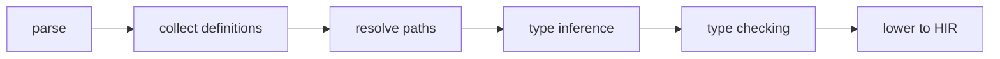
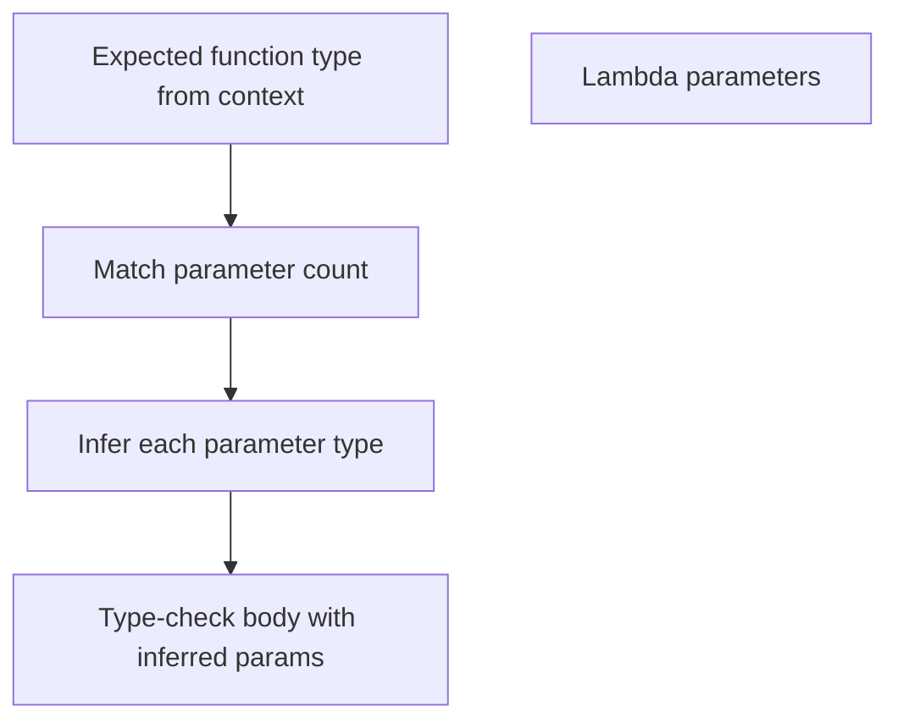

import SpecArticleChrome from '@beskid/beskid-ui/platform-spec/SpecArticleChrome.astro';

<SpecArticleChrome />

## Compile pipeline placement

Type inference runs during the semantic analysis phase, after parsing and before HIR lowering:

## `try_infer` algorithm (normative)

1. **Collect inference sites** — Walk the AST and identify `let` bindings, lambda parameters, and generic call sites without explicit types.
2. **Build constraint graph** — For each site, collect type constraints from the surrounding expression context.
3. **Solve local constraints** — Attempt to find a unique type for each unannotated binding.
4. **Check against expected** — Verify the inferred type matches any explicit constraints (for example, the return type of the enclosing function).
5. **Emit ambiguity errors** — If multiple types satisfy constraints, emit **E1202** at the binding site.

## Lambda parameter inference

- The expected function type comes from the enclosing expression (for example, a function argument position).
- If the lambda has `n` parameters and the expected type has `n` argument types, each parameter is bound to the corresponding argument type.
- If no expected type exists, untyped lambda parameters require explicit annotations or emit **E1202**.

## Generic call-site inference

When generic arguments are omitted at a call site:
1. Collect the types of the actual arguments.
2. Match them against the generic parameter constraints in the callee signature.
3. If a unique substitution exists, apply it.
4. If ambiguous or missing, emit **E1203** or **E1204**.

## Return type inference

For functions without an explicit return type annotation:
1. Type-check the body.
2. If the body ends with an expression, use that expression's type as the inferred return type.
3. If the body ends with statements only, default to `unit`.
4. Public API functions should declare return types explicitly even when inference succeeds.
