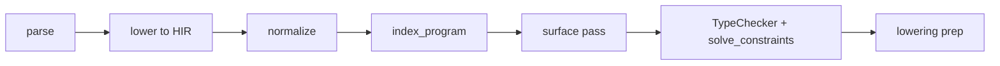
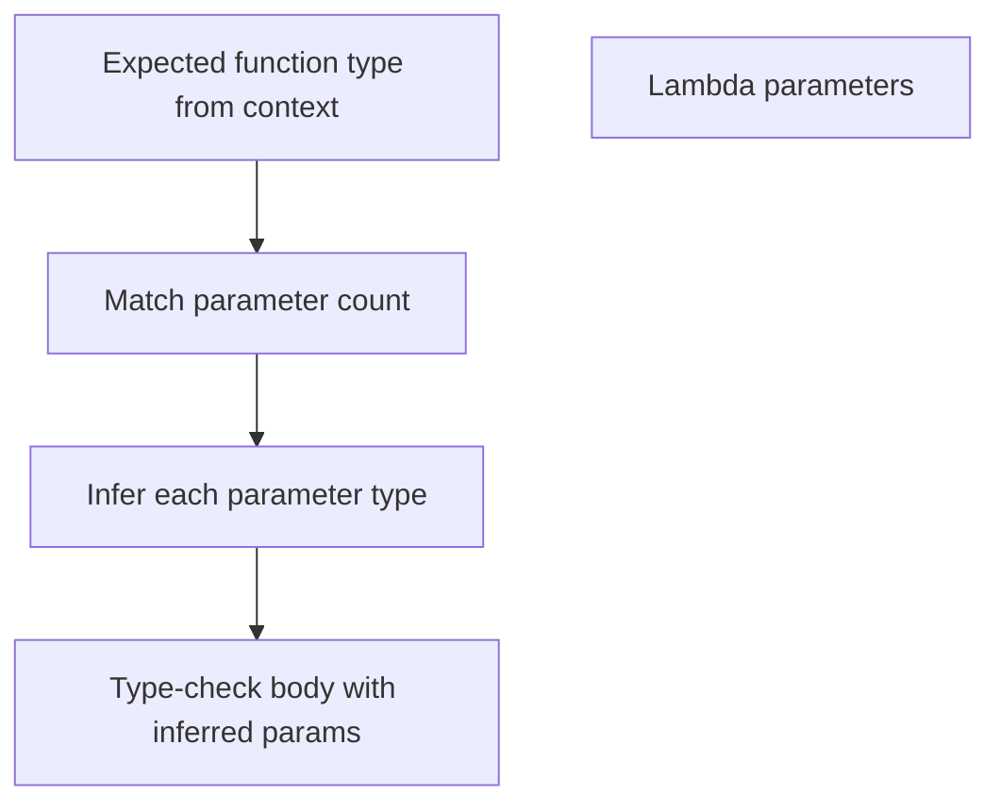

import SpecArticleChrome from '@beskid/beskid-ui/platform-spec/SpecArticleChrome.astro';

<SpecArticleChrome />

## Compile pipeline placement

Type inference runs inside the **check** sub-pass of **`lower.type_check`**, after `index_program` and the surface pass, and before lowering prep:

Entry point: [`TypeChecker::check_entry`](compiler/crates/beskid_analysis/src/types/checker/entry.rs), orchestrated from [`type_check_lowered_hir`](compiler/crates/beskid_analysis/src/services/lower.rs) under phase id **`lower.type_check`**.

## Constraint-driven inference (normative)

Inference is **local and constraint-driven**, not global Hindley-Milner. During the check pass:

1. **Collect inference sites** — Walk HIR bodies and identify `let` bindings, lambda parameters, and generic call sites without explicit types.
2. **Emit constraints** — For each site, push `Equal`, `EqualVar`, `ApplyGeneric`, `IsNumeric`, or `VariantOf` constraints into a `ConstraintSet` on the active `TypeChecker`.
3. **Record provisional types** — Write `node_types[HirNodeId]` and `local_types[LocalId]` as expressions are walked.
4. **Solve at finish** — `TypeChecker::finish` calls [`solve_constraints`](compiler/crates/beskid_analysis/src/types/inference/solve.rs) against a read-only `TypeEnv` backed by the hash-consed `TypeTable`.
5. **Emit ambiguity errors** — If multiple types satisfy constraints, emit **E1202** at the binding site.

## Lambda parameter inference

- The expected function type comes from `contextual_expected_type` on the enclosing `TypeChecker` (for example, a function argument position).
- If the lambda has `n` parameters and the expected type has `n` argument types, each parameter is bound to the corresponding argument type.
- If no expected type exists, untyped lambda parameters require explicit annotations or emit **E1202**.

## Generic call-site inference

When generic arguments are omitted at a call site:
1. Collect the types of the actual arguments.
2. Match them against the generic parameter constraints in the callee signature via `ApplyGeneric` constraints.
3. If a unique substitution exists, apply it during `solve_constraints`.
4. If ambiguous or missing, emit **E1203** or **E1204**.

## Return type inference

For functions without an explicit return type annotation:
1. Type-check the body with `current_return_type` unset.
2. If the body ends with an expression, use that expression's type as the inferred return type.
3. If the body ends with statements only, default to `unit`.
4. Public API functions should declare return types explicitly even when inference succeeds.
