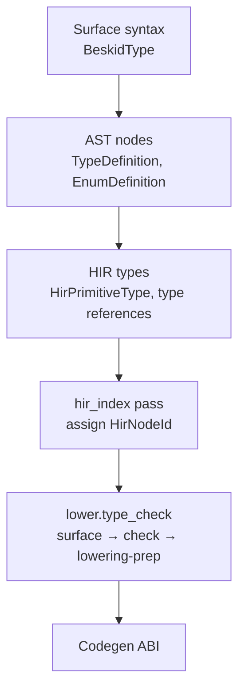

import SpecArticleChrome from '@beskid/beskid-ui/platform-spec/SpecArticleChrome.astro';

<SpecArticleChrome />

## Vocabulary

| Construct | Role |
| --- | --- |
| **`BeskidType`** | AST node representing any type expression in the grammar |
| **`TypeDefinition`** | Nominal record-like type with fields, inline methods, and conformances |
| **`EnumDefinition`** | Sum type with named variants and optional payload fields |
| **`HirPrimitiveType`** | Lowered primitive type enum used by HIR and codegen |
| **`BeskidArray`** | Runtime fat-pointer layout for array values |
| **`HirNodeId`** | Dense stable id for every typable HIR node within one compilation session |
| **`TypeId`** | Opaque handle into a hash-consed [`TypeTable`](#type-table) |
| **`UnitTypeSurface`** | Per-unit exported signatures, field layouts, and generic arity for dependency typing |

## Type system architecture

The type system is organized into three layers:

### Surface syntax layer

Parsed from `beskid.pest` grammar productions. The `BeskidType` enum covers primitives, named paths, arrays, references, and function types. This layer lives in `compiler/crates/beskid_analysis/src/syntax/`.

### AST declaration layer

`TypeDefinition` (from `syntax/items/type_definition.rs`) stores:
- `visibility`, `name`, `generics`, `conformances`, `fields`, `methods`
- Per-field documentation via `field_docs`; per-method documentation via `method_docs`

Inline methods use the same implicit-receiver model as `extend type` methods but may access private fields of the owning type. `extend type` methods may access **public** fields only (**E1511**).

`EnumDefinition` (from `syntax/items/enum_definition.rs`) stores:
- `visibility`, `name`, `generics`, `variants`
- Per-variant documentation via `variant_docs`

### HIR and analysis layer

After HIR normalization, the reference compiler assigns stable node ids and runs a three-stage type pass under **`lower.type_check`** (see [Type-system pass contract](/platform-spec/compiler/semantic-pipeline/type-system-pass-contract/design-model/)).

#### `HirNodeId` on `Spanned<T>`

Every typable HIR node is wrapped in [`Spanned<T>`](compiler/crates/beskid_analysis/src/syntax/common/span.rs) with three fields: `node`, `span`, and `id: HirNodeId`. New nodes start with `HirNodeId::INVALID`; [`index_program`](compiler/crates/beskid_analysis/src/hir/index.rs) runs **after normalize** and **before** type checking to assign dense `u32` ids in pre-order walk order.

Ids are assigned to expressions, statements, patterns, type-annotated `let` bindings, and match arms. **`HirNodeId` is per compilation session** — it is not serialized and does not cross unit boundaries. Cross-unit typing uses [`ItemId`](#dual-identity-with-resolution) and [`UnitTypeSurface`](#unit-type-surface), not expression ids from dependencies.

**Normative:** HIR normalization that clones or rewrites nodes **must** preserve or remap ids (re-run `index_program` when ids cannot be preserved).

#### Type table

[`TypeTable`](compiler/crates/beskid_analysis/src/types/table.rs) hash-conses structural type info (`TypeInfo`) into opaque [`TypeId`](compiler/crates/beskid_analysis/src/types/table.rs) handles. Primitive and array element lookups are O(1) via dedicated indexes; consumers **must not** scan the intern table linearly.

#### Unit type surface

[`UnitTypeSurface`](compiler/crates/beskid_analysis/src/types/surface.rs) captures the **exported** type shape of one compilation unit in a single walk:

- struct field order and field types
- enum variant payloads
- function and method signatures (including receiver metadata)
- generic parameter lists per item
- contract and foreign-export signatures when present

Dependency units contribute surfaces only; entry compilation merges surfaces into a `MergedTypeEnv` before body checking. Surfaces are keyed by **`ItemId`**, not `HirNodeId`.

Per-unit surfaces are cached incrementally via Salsa (`unit_type_surface_tracked` in `beskid_queries`); the type pass **must not** re-parse dependency sources from disk for prefetch typing.

#### `TypeResult` and node-keyed expression types

The authoritative output of **`lower.type_check`** is [`TypeResult`](compiler/crates/beskid_analysis/src/types/mod.rs), exported from `beskid_analysis::types`. Expression types are stored in **`node_types: HashMap<HirNodeId, TypeId>`** — the primary lookup table for codegen and IDE queries.

| Field | Key | Role |
| --- | --- | --- |
| `types` | — | Hash-consed `TypeTable` |
| `node_types` | `HirNodeId` | Expression and statement result types |
| `local_types` | `LocalId` | Function-local binding types |
| `unit_surfaces` | source path | Cached per-unit `UnitTypeSurface` |
| `function_signatures` | `ItemId` | Top-level and nested function signatures |
| `method_function_signatures` | `ItemId` | Method signatures (receiver-aware) |
| `struct_fields_ordered` | `ItemId` | Declaration-order field names and types |
| `enum_variants_ordered` | `ItemId` | Variant names and payload type lists |
| `generic_items` | `ItemId` | Generic parameter name lists |
| `lowering` | `HirNodeId` | [`LoweringPrep`](#lowering-prep) — call dispatch and cast intents |

**Deleted (normative):** span-keyed `expr_types`, `scoped_expr_types`, top-level `call_kinds` / `cast_intents` flat maps, and `TypeResult::expr_type_at`. Lookup **must** use `node_type(HirNodeId)` or `expr_type(&Spanned<HirExpressionNode>)` (reads `node.id`).

#### Lowering prep

[`LoweringPrep`](compiler/crates/beskid_analysis/src/types/lowering_prep.rs) is produced in a dedicated sub-pass **after** body typing and **before** codegen consumes `TypeResult`:

- `call_kinds: HashMap<HirNodeId, CallLoweringKind>` — how each call site lowers
- `cast_intents: Vec<CastIntent>` — each intent carries `node_id: HirNodeId` (span retained for diagnostics only)

Lowering prep walks an already-typed tree; it performs **no** type inference.

#### Dual identity with resolution

Type maps use **`ItemId`** and **`LocalId`** from resolution ([Resolver contract](/platform-spec/compiler/semantic-pipeline/resolver-contract/design-model/)). `SpanIndex` (`resolve/span_index.rs`) maps `(source_path, byte_offset)` to `ItemId` / `LocalId` / `HirNodeId` for IDE navigation; type lookup **must not** fall back to fuzzy span scans.

## Subsystem boundaries

| Subsystem | Responsibility | Key file |
| --- | --- | --- |
| Parser | Validate type syntax shape | `beskid.pest` |
| AST | Store declaration structure | `syntax/items/type_definition.rs` |
| HIR lowering | Normalize type references | `hir/lowering/items.rs` |
| HIR index | Assign `HirNodeId` after normalize | `hir/index.rs` |
| Type surface | Build per-unit exported shapes | `types/surface.rs`, `services/unit_ops.rs` |
| Type checker | Body typing; emit constraints | `types/checker.rs` |
| Inference | Solve local constraint sets | `types/inference/` |
| Lowering prep | Call kinds and cast intents | `types/lowering_prep.rs` |
| Type orchestration | Wire three passes on lower spine | `services/lower.rs` |
| Semantic rules | Structural immutability only | `analysis/rules/staged/type_checking.rs` |
| Codegen | Read `node_types` and `lowering` | `beskid_codegen` |

## Nominal type model

Beskid uses **nominal** types resolved by path. Two structurally identical types with different names are incompatible. The compiler enforces this through `TypeMismatch` diagnostics (**E1206**) when paths differ.

## Array representation

`T[]` uses a single runtime representation (`BeskidArray`) across targets: a fat pointer carrying length plus data pointer. This is locked by decision **D-LM-TYP-003**.

## Mutability

`mut` is a **prefix modifier** on bindings: `mut T name` for typed locals and parameters, `let mut name` for inferred locals. Parameters pass by value in v0.1.
