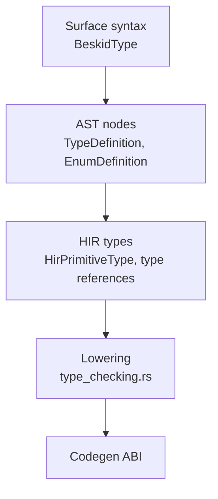

import SpecArticleChrome from '@beskid/beskid-ui/platform-spec/SpecArticleChrome.astro';

<SpecArticleChrome />

## Vocabulary

| Construct | Role |
| --- | --- |
| **`BeskidType`** | AST node representing any type expression in the grammar |
| **`TypeDefinition`** | Nominal record-like type with fields, inline methods, and conformances |
| **`EnumDefinition`** | Sum type with named variants and optional payload fields |
| **`HirPrimitiveType`** | Lowered primitive type enum used by HIR and codegen |
| **`BeskidArray`** | Runtime fat-pointer layout for array values |

## Type system architecture

The type system is organized into three layers:

### Surface syntax layer

Parsed from `beskid.pest` grammar productions. The `BeskidType` enum covers primitives, named paths, arrays, references, and function types. This layer lives in `compiler/crates/beskid_analysis/src/syntax/`.

### AST declaration layer

`TypeDefinition` (from `syntax/items/type_definition.rs`) stores:
- `visibility`, `name`, `generics`, `conformances`, `fields`, `methods`
- Per-field documentation via `field_docs`; per-method documentation via `method_docs`

Inline methods use the same implicit-receiver model as `extend type` methods but may access private fields of the owning type. `extend type` methods may access **public** fields only (**E1511**).

`EnumDefinition` (from `syntax/items/enum_definition.rs`) stores:
- `visibility`, `name`, `generics`, `variants`
- Per-variant documentation via `variant_docs`

### HIR and analysis layer

The `types/` directory in `beskid_analysis` implements context-driven type checking:
- `types/context/context.rs` — main type context with symbol tables
- `types/context/expressions.rs` — expression type inference
- `types/context/items.rs` — item-level type checking
- `types/context/statements.rs` — statement type checking
- `types/context/try_infer.rs` — local type inference for `let` bindings

## Subsystem boundaries

| Subsystem | Responsibility | Key file |
| --- | --- | --- |
| Parser | Validate type syntax shape | `beskid.pest` |
| AST | Store declaration structure | `syntax/items/type_definition.rs` |
| HIR lowering | Normalize type references | `hir/lowering/items.rs` |
| Type context | Resolve and check types | `types/context/context.rs` |
| Semantic rules | Emit type diagnostics | `analysis/rules/staged/type_checking.rs` |
| Codegen | Choose runtime layout | `beskid_codegen` |

## Nominal type model

Beskid uses **nominal** types resolved by path. Two structurally identical types with different names are incompatible. The compiler enforces this through `TypeMismatch` diagnostics (**E1206**) when paths differ.

## Array representation

`T[]` uses a single runtime representation (`BeskidArray`) across targets: a fat pointer carrying length plus data pointer. This is locked by decision **D-LM-TYP-003**.

## Reference semantics

`ref T` is a **passing mode**, not a separate type class. It appears only in parameter signatures and denotes by-reference aliasing. There is no `ref T` value type distinct from `T`.
