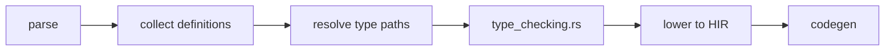

import SpecArticleChrome from '@beskid/beskid-ui/platform-spec/SpecArticleChrome.astro';

<SpecArticleChrome />

## Compile pipeline placement

## Type declaration collection algorithm

1. **Parse program** — `Program = ItemList` from `beskid.pest`; each `TypeDefinition` and `EnumDefinition` becomes an AST node.
2. **Collect definitions** — `analysis/rules/staged/definitions.rs` walks items and builds a name-to-definition map.
3. **Check duplicates** — `DuplicateDefinitionName` (**E1001**) and `DuplicateItemName` (**E1006**) fire when names collide in the same scope.
4. **Validate conformance targets** — `ResolveInvalidConformanceTarget` (**E1607**) checks that `: Contract` paths resolve to actual contract definitions.

## Type checking algorithm (normative)

1. **Build type context** — `TypeContext::new()` initializes primitive mappings (`bool`, `i32`, `i64`, `u8`, `f64`, `char`, `string`, `unit`).
2. **Register declarations** — Each `TypeDefinition` and `EnumDefinition` registers its name and generic arity.
3. **Check field types** — Every field in a type declaration must resolve to a known type; `UnknownTypeInDefinition` (**E1005**) otherwise.
4. **Check generic arity** — Use sites must supply the correct number of arguments; `TypeMissingTypeArguments` (**E1203**) or `TypeGenericArgumentMismatch` (**E1204**) otherwise.
5. **Check member access** — `TypeInvalidMemberTarget` (**E1213**) when the receiver type does not expose the accessed member.
6. **Check array element access** — Bounds checks are inserted at lowering time unless proven safe.

## Primitive lowering

Primitives map directly to `HirPrimitiveType` variants:

| Surface | HIR variant |
| --- | --- |
| `bool` | `Bool` |
| `i32` | `I32` |
| `i64` | `I64` |
| `u8` | `U8` |
| `f64` | `F64` |
| `char` | `Char` |
| `string` | `String` |
| `unit` | `Unit` |

## Type path resolution

Named types (`Path` with optional `GenericArguments`) resolve through the same scope chain as value paths:
- Local generic parameters shadow outer type names.
- Imported types via `use` participate in resolution.
- Unknown type paths emit `TypeUnknownType` (**E1201**).

## LSP / incremental

Re-run type checking when `TypeDefinition`, `EnumDefinition`, field shapes, or generic parameter lists change.
