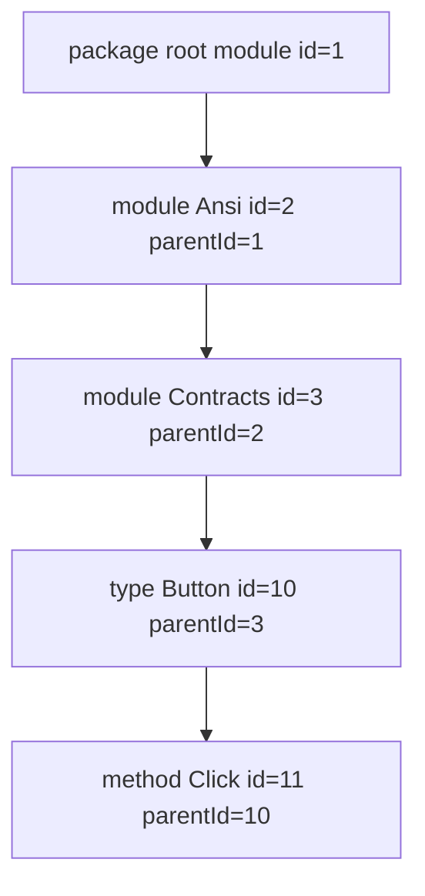

import SpecArticleChrome from '@beskid/beskid-ui/platform-spec/SpecArticleChrome.astro';

<SpecArticleChrome />

## What this covers

Normative shape of **`api.json` schema version 4** with **`navigationModel: "graph-v1"`**. The file lists **every resolved symbol** in the compiled API surface (documented or not). Compiler-derived **signatures** and **type annotations** are mandatory for consumers that render API reference UI; `///` comments only add optional prose.

## C#-style ergonomics

| Authoring | Beskid rule |
| --- | --- |
| XML doc optional; metadata from symbols | `doc` / `docMarkdown` optional on every item row |
| Signature from reflection | `signature`, `parameters`, `returnType`, `fieldType` from HIR + resolution |
| `cref` links | `typeAnnotation.refItemId` for type positions; `@ref` in `///` for prose cross-links |
| Multi-file projects | `beskid doc --project` uses **workspace scan** assembly (all `*.bd` under host + path dependency roots), merges resolution per unit, and sets `location.file` per declaring unit (paths **package-relative** to the declaring package source root, forward slashes) |

`ImportClosure` assembly (entry `use` graph only) is **not** used for `api.json` emission when a `Project.proj` is resolved; prelude-style re-export entrypoints otherwise document only the entry file.

## Root object

| Field | Required | Description |
| --- | --- | --- |
| `schemaVersion` | yes | `4` for this revision (`3` remains readable; new fields optional on v3) |
| `navigationModel` | yes when `schemaVersion >= 3` | Must be `"graph-v1"` |
| `generator` | yes | Tool id (for example `beskid doc`) |
| `source` | yes | Entry source path for the doc run, **artifact-relative** (forward slashes; same path as inside the published `.bpk`, never a host absolute or `obj/beskid/...` path) |
| `items` | yes | Flat list of API rows sharing one `id` space |

## Navigation invariants

### `parentId` tree (graph-v1)



Consumers walk **`parentId`** links upward to build breadcrumbs; **`memberIds`** lists direct children in emission order. Never infer parenthood from `qualifiedName` string splits.

1. Consumers **must** build trees from **`parentId`** and **`memberIds`** only — not by splitting `qualifiedName`.
2. Every item in schema v3+ **must** have **`id`**.
3. Every non-null **`parentId`** **must** reference an existing item **`id`**.
4. **`memberIds`** is emission-order redundant with `parentId`; consumers may use either, but **must not** infer parenthood from name strings.

### Library tree invariants (graph-v1 emitters)

Emitters producing registry API reference UI (for example `beskid doc` on a `Project.proj`) **must** wire a **library tree**, not a flat symbol list:

| Rule | Requirement |
| --- | --- |
| Module nesting | Every `module` row except the package root **must** have `parentId` pointing at its parent `module` item. Prefix modules **must** exist (synthetic rows allowed) so paths like `["Ansi","Contracts"]` are fully linked. |
| Module ownership | Module-level declarations (`type`, `enum`, `contract`, `function`, nested `module`) **must** have `parentId` equal to the owning module item. |
| Detail-only members | `field`, `method`, `contract_method`, `parameter`, `enum_variant`, and similar **must** appear only under their declaring type, enum, or contract — not as graph roots. |
| `modulePath` | On `module` rows, `modulePath` **must** list every logical segment including the module’s own name (for example `["Ansi","Contracts"]` for `Ansi::Contracts`). |
| Roots | After linking, graph roots **should** be top-level modules, optional dependency package groups, or a single package overview — not hundreds of unrelated symbols. |

Consumers (pckg) **may** insert UI-only folder nodes (for example **Types**, **Enums**, **Contracts**, **Functions**) under each module; those folders are **not** serialized in `api.json`.

### Nav kinds (registry UI)

| Nav role | `kind` values shown in the left library tree |
| --- | --- |
| Explorer | `module`, `type`, `enum`, `contract`, `function` |
| Detail only | `field`, `method`, `contract_method`, `parameter`, `enum_variant`, … |

Nav role is **derived from `kind`** unless a future schema adds an explicit `navRole` field.

## Item row (schema v4)

Core identity (unchanged from v3): `id`, `qualifiedName`, `name`, `displayName`, `kind`, `visibility`, `location`, `parentId`, `memberIds`, `docMarkdown`, `doc`, `controls`.

### Compiler-derived fields (v4)

| Field | When present | Meaning |
| --- | --- | --- |
| `modulePath` | Root symbols | Logical module segments, e.g. `["Std","Widgets"]` |
| `signature` | Most kinds | Single-line display signature for headers and search |
| `fieldType` | `field`, `parameter` | [`typeAnnotation`](#typeannotation) for the member type |
| `returnType` | `function`, `method`, `contract_method` | Return type annotation |
| `parameters` | Callables | Ordered `{ name, type, modifier?, docMarkdown? }` |
| `genericParameters` | Types, enums, callables with generics | `{ name }` list from HIR |
| `declaringPackage` | Workspace scan / aggregate publish | Registry package id when the symbol is defined in another workspace package (optional on v4; omit when same package). With `location.file`, paths are relative to **that** package's artifact root, not the publishing package |

### typeAnnotation

```json
{
  "display": "MyLib.Widgets.Button",
  "refItemId": 42
}
```

- **`display`**: formatted type text (primitives, arrays, refs, paths).
- **`refItemId`**: present when resolution maps the type span to a **type-like** item (`type`, `enum`, `contract`). Omitted for primitives, unresolved paths, and generic parameters.

Type links in UI **must** use **`refItemId`**, not string parsing of `display`.

## Documentation fields

- **`docMarkdown`**: full rendered body (resolved `@ref` links when packed with package identity).
- **`doc`**: structured sections (`summaryMarkdown`, `returnsMarkdown`, `arguments`, `enumVariants`, `typeParameters`) from the `///` mini-language.
- **`@arg`** is only valid on **callable** declarations; field docs use per-field `///` or parent enum `@variant`.

Undocumented symbols **must** still appear with `signature` / type fields and **null** doc fields.

## Backward compatibility

- Consumers supporting only v3 **may** ignore v4-only fields.
- Emitters **must** bump `schemaVersion` to `4` when emitting signatures or `typeAnnotation`.
- Legacy v2 (no graph) is symbol-list fallback when resolution fails; pckg requires v3+ for structured docs UI.

## Code anchors

- Schema types: `compiler/crates/beskid_analysis/src/doc/api_snapshot.rs`
- Emission: `compiler/crates/beskid_cli/src/commands/doc.rs`
- Pack validation: `compiler/crates/beskid_pckg/src/api_doc.rs`
- Registry UI: `pckg/src/Server/Components/Docs/`
