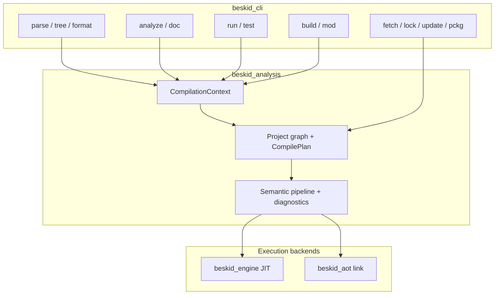

import SpecArticleChrome from '@beskid/beskid-ui/platform-spec/SpecArticleChrome.astro';

<SpecArticleChrome />

## Purpose

The `beskid` executable is a thin orchestration layer over **`beskid_analysis`** (project graph, semantic pipeline, document snapshots) and backend-specific drivers (**JIT** for `run`/`test`, **AOT** for `build`, **CLIF** introspection). Every project-scoped command shares the same resolution inputs (`ProjectResolveArgs`, `LockfilePolicyArgs`) and **must** provision bundled corelib before dispatch (`ensure_corelib_ready` in `compiler/crates/beskid_cli/src/cli.rs`).

## Layered model

| Layer | Responsibility |
| --- | --- |
| **Argv + global flags** | `@file` expansion, `--log-cranelift`, subcommand dispatch |
| **Project resolution** | Discover `Project.proj` / `Workspace.proj`, honor lockfile policy, build `CompilationContext` |
| **Pipeline observation** | Map `beskid_pipeline` phase IDs to stderr spinners or `--plain` lines |
| **Command backend** | `analyze` emits diagnostics only; `build` lowers + AOT; `run`/`test` JIT entrypoints |

## Shared resolution contract

`build`, `run`, `test`, `analyze`, `doc`, `clif`, and `format` (when given a project input) **must** enter analysis through the same helpers that construct a **`CompilationContext`** for the resolved manifest path. Mod registration on the host compilation **must** occur after the dependency graph is materialized and before semantic gates, per **[Stage ordering and lowering](/platform-spec/compiler/build-pipeline/stage-ordering/)**.

File-only commands (`parse`, `tree` with a single `.bd` path) may bypass the project graph but still use the parser and formatter crates directly.

## Compiler mods on the CLI

**`Mod`** projects are graph-discovered packages compiled AOT and loaded during host builds. CLI **`beskid mod`** manages artifact cache lifecycle; **`beskid build` / `run` / `test` / `analyze`** route mod work through **`beskid_analysis`** orchestration—the same entrypoints the LSP uses—so diagnostic codes, capability denial, and generator round caps match IDE behavior.

| Concern | Normative rule |
| --- | --- |
| Progress | New pipeline phase IDs **must** surface through the CLI `PipelineObserver` implementation |
| Diagnostics | Meta and semantic diagnostics share `SemanticDiagnostic` / miette shaping |
| Parity | Changing mod scheduling **must** update CLI, LSP, and **[Diagnostics parity](/platform-spec/compiler/build-pipeline/diagnostics-parity/)** together |

## Implementation anchors

- Subcommand wiring: `compiler/crates/beskid_cli/src/cli.rs`, `compiler/crates/beskid_cli/src/commands/`
- Resolution + pipeline UI: `compiler/crates/beskid_cli/src/frontend.rs`, `compiler/crates/beskid_cli/src/project_args.rs`
- Analysis services: `compiler/crates/beskid_analysis/src/services.rs`, `compilation_context.rs`
- JIT launch: `compiler/crates/beskid_engine/`
- AOT link: `compiler/crates/beskid_aot/`
