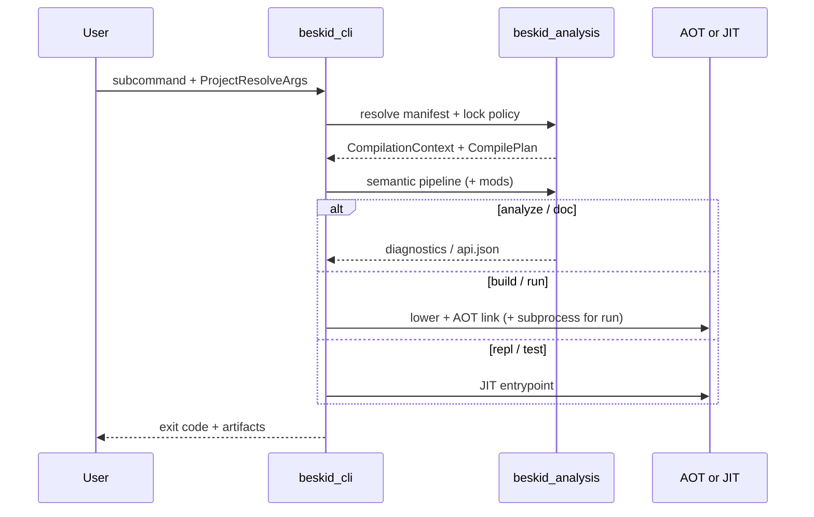

import SpecArticleChrome from '@beskid/beskid-ui/platform-spec/SpecArticleChrome.astro';

<SpecArticleChrome />

## Startup

1. Expand response files (`argfile`) and parse global flags.
2. Initialize logging (`BESKID_LOG_CRANELIFT` / `--log-cranelift`).
3. **`ensure_corelib_ready`** — materialize or locate bundled corelib before any project command runs.
4. Dispatch the selected subcommand.

## Project-scoped command flow

### `analyze`

1. Resolve input to a host target and `CompilationContext`.
2. Run the semantic pipeline with builtin (+ mod) rules.
3. Print diagnostics to stderr (miette rendering); non-zero exit when errors exist.

### `build`

1. Resolve `CompilePlan` and target kind (`App`, `Lib`, `Test`).
2. Lower through `beskid_codegen` with pipeline observation.
3. Invoke `beskid_aot::build` with profile, link mode, and runtime strategy flags.
4. Write object/shared/static/executable per `--kind` and target defaults.

### `run`

1. Resolve entry module and optional `--entrypoint`.
2. Lower through `beskid_codegen` with pipeline observation (`RUN_AOT_PHASE_ORDER`).
3. Link an executable via `beskid_aot::build` and execute it in a subprocess; forward stdout/stderr and propagate the child exit code.

### `test` (interim JIT)

1. Resolve entry module and discover `test` items.
2. JIT-compile via `beskid_engine` in-process and aggregate results. Phase 2 will migrate this path to AOT.

### `repl`

1. Read single expression or statement snippets from stdin (no project graph in v1).
2. JIT-compile each snippet via a persistent `beskid_engine::Engine` session in `beskid_repl`.
3. Print formatted results; `:quit` and `:reset` control session lifecycle. See **[REPL command](/platform-spec/tooling/cli/repl-command/)**.

### Workspace maintenance (`fetch`, `lock`, `update`)

These commands mutate or verify the materialized dependency tree and `Project.lock` **before** host compilation. They share graph resolution with build/run but do not themselves lower user code.

## Lockfile interaction

When `LockfilePolicyArgs` require a lock, the CLI **must** fail fast if `Project.lock` is missing or stale relative to manifests, rather than silently fetching in release-critical paths unless the command documents otherwise (`update` vs `build` defaults).

## Verification hooks

Integration coverage lives in `compiler/crates/beskid_tests/src/analysis/pipeline/core.rs` and command-specific tests beside each `commands/*.rs` module.
