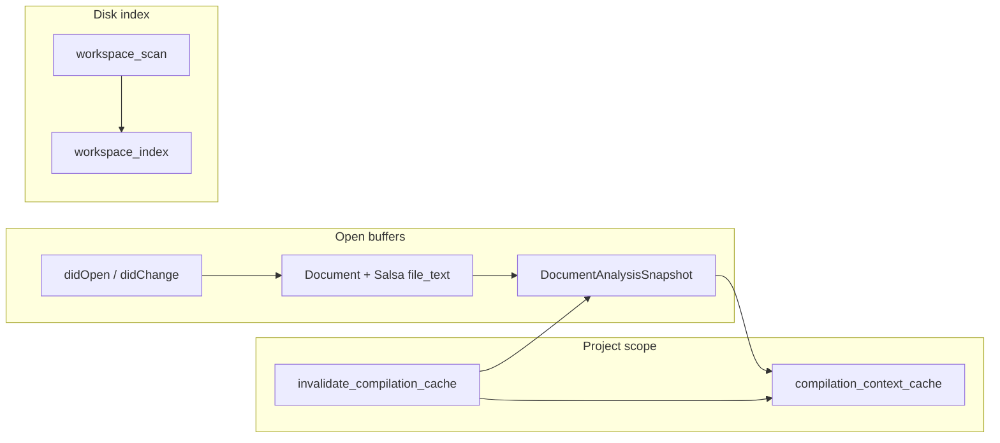

import SpecArticleChrome from '@beskid/beskid-ui/platform-spec/SpecArticleChrome.astro';

<SpecArticleChrome />

## Purpose

The Beskid LSP maintains open document buffers (`State.docs`), disk-backed workspace index entries (`State.workspace_index`), optional **`DocumentAnalysisSnapshot`** values versioned by `ANALYSIS_CACHE_VERSION`, and a workspace-scoped **`beskid_queries::BeskidDatabase`** (`State.compilation_db`) that owns incremental invalidation. A separate **`CompilationContext`** cache keys off resolved `Project.proj` paths plus workspace member defaults.

## Invalidation model

`didChange` **must** call `BeskidDatabase::ensure_file_text` for the edited URI before rebuilding snapshots or publishing diagnostics. Manual per-document `text_hash` fast paths are replaced by Salsa revision tracking and query invalidation; `ANALYSIS_CACHE_VERSION` remains the snapshot **shape** version only.

## Snapshot stores

| Store | Key | Invalidation trigger |
| --- | --- | --- |
| Open `Document` | LSP `Uri` | Text change, version bump, cache version mismatch |
| Disk snapshot | `Uri` (file not open) | Workspace scan, external file watcher refresh |
| `CompilationContext` | `(Project.proj path, member default)` | Manifest/lock/graph changes, explicit invalidation |

## Analysis snapshot contents

`build_document_analysis` calls `beskid_analysis::services::build_document_analysis_with_context` when a `CompilationContext` exists. Project manifest URIs (`.proj`) **must not** produce analysis snapshots—only Beskid sources.

## Hard vs soft invalidation

**Hard invalidation** clears `compilation_context_cache` and bumps per-document `analysis_cache_version` so every open buffer re-analyzes:

- `Project.proj`, `Workspace.proj`, or lockfile writes affecting dependency roots
- `project.mod` changes on attached `Mod` projects
- Full workspace rescan after `invalidate_compilation_cache` (`workspace_scan.rs`, `backend.rs`)

**Soft invalidation** (re-run meta without full graph rebuild) is permitted only when capture keys remain valid; otherwise the server **must** hard-invalidate per **[Incremental scheduling and determinism](/platform-spec/compiler/compiler-mods/incremental-scheduling-determinism/)**.

## Status reporting

Workspace scans emit `BeskidStatusParams` with `phase: workspace_scan` and throttled progress (`STATUS_EMIT_INTERVAL` 200ms) so the VS Code extension can mirror CLI-style progress in the status bar.

## Implementation anchors

- Document lifecycle: `compiler/crates/beskid_lsp/src/session/lifecycle.rs`
- Project context cache: `compiler/crates/beskid_lsp/src/session/project_context.rs`
- Workspace scan: `compiler/crates/beskid_lsp/src/workspace_scan.rs`
- Server wiring: `compiler/crates/beskid_lsp/src/server/backend.rs`
- Diagnostics publish debounce: 120ms coalescing in `schedule_publish_diagnostics`
