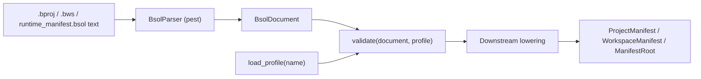

import SpecArticleChrome from '@beskid/beskid-ui/platform-spec/SpecArticleChrome.astro';

<SpecArticleChrome />

## Vocabulary

| Construct | Role |
| --- | --- |
| **`bsol.pest`** | Authoritative PEG grammar (single syntactic truth for all Bsol documents) |
| **`BsolParser`** | Pest-derived parser entry type in `beskid_bsol` |
| **`BsolDocument`** | Generic root AST: ordered top-level blocks |
| **`SchemaProfile`** | Declarative rule set loaded from embedded `*.v1.bsol` profile files |
| **`ValidatedDocument`** | AST after schema validation; input to downstream lowering |
| **`ProjectManifest` / `WorkspaceManifest` / `ManifestRoot`** | Typed models produced **after** profile validation + lowering |

## Pipeline



## Lexical rules

- **Whitespace** (` `, tab, newline) is insignificant except as a separator.
- **Comments:** `#` to end of line, or `//` to end of line (not inside string literals at the grammar layer; manifest authors should avoid `#` inside quoted paths).
- **Identifiers:** ASCII letter or `_`, then alphanumeric/`_`.
- **Quoted strings:** `"..."` with no escape sequences (content between quotes is literal).
- **Bracket lists:** `[ item (, item)* ]` where each item is `default`, an identifier, or a quoted string.
- **Assignments:** `ident = value` with optional surrounding whitespace.

## Surface document shape

A Bsol document is a sequence of blocks. Each block has the same syntactic form:

```bsol
block_kind optional "label" {
  key = value
  nested_block { ... }
}
```

Optional **`@schemaless`** before `{` captures the inner `{ ... }` text verbatim without parsing assignments (profile rule must set `schemaless = true`):

```bsol
opaque @schemaless {
  raw { nested } text preserved
}
```

When present, the AST stores the body in `BsolBlock.schemaless_body` instead of `items`.

Manifest-specific block kinds (`target`, `dependency`, `workspace`, `kernel`, …) are **not** encoded in the grammar. They are defined by **schema profiles** (`project.v1`, `workspace.v1`, `runtime.v1`).

## Normative Rust AST

The reference compiler **must** build the following types from a successful Bsol parse. Field names are stable contract surface for tooling, LSP, and test fixtures.

```rust
/// A parsed Bsol document (any profile).
pub struct BsolDocument {
    pub blocks: Vec<BsolBlock>,
}

/// One block in a Bsol document.
pub struct BsolBlock {
    pub span: BsolSpan,
    pub kind: String,                      // block keyword
    pub label: Option<BsolQuotedString>,   // optional quoted label
    pub schemaless_body: Option<String>,   // set when `@schemaless` is used
    pub items: Vec<BsolItem>,
}

/// Body item: assignment or nested block.
pub enum BsolItem {
    Assignment(BsolAssignment),
    Block(BsolBlock),
}

pub struct BsolAssignment {
    pub span: BsolSpan,
    pub key: String,
    pub value: BsolValue,
}

pub enum BsolValue {
    QuotedString(BsolQuotedString),
    Ident(String),
    BracketList(BsolBracketList),
}

pub struct BsolQuotedString {
    pub span: BsolSpan,
    pub value: String,
}

pub struct BsolBracketList {
    pub span: BsolSpan,
    pub items: Vec<BsolListItem>,
}

pub enum BsolListItem {
    Default,
    QuotedString(BsolQuotedString),
    Ident(String),
}

/// UTF-8 source span with 1-based line index for diagnostics.
pub struct BsolSpan {
    pub start: usize,
    pub end: usize,
    pub line: usize,
}
```

Source of truth in the repository: `beskid_bsol/crates/bsol-syntax/src/ast.rs`.

### BSOL v2 extensions

v2 adds optional syntax and schema features (backward compatible with v1 documents):

- **Attributes:** `[Deprecated(since = "2.0")]` on blocks
- **References:** `@node/label` in assignments and lists
- **Inline maps:** `{ key = value, ... }`
- **Typed validation:** `ValidatedValue` alongside string-compat `fields` map
- **Profile composition:** `extends`, `mixes`, `extend "base.v1"`, `import_schema` merge
- **Discriminated unions:** `variant "git" { require = [url, rev] }`
- **Migration routes:** `migration { from = "project.v1" ... }` with `beskid migrate-bsol`

Embedded v2 profiles: `project.v2`, `runtime.v2`, `board.v3`, `configuration.v2`, `schema.v2`.

## Schema profiles

Profiles ship embedded in `beskid_bsol` (`include_str!` from `schemas/`). The only non-declarative layer is the Rust bootstrap loader in `schema/load.rs`.

| Profile | Document | Lowering crate |
| --- | --- | --- |
| `project.v1` / `project.v2` | `*.bproj` project manifests | `beskid_analysis::projects::parser` |
| `workspace.v1` | `*.bws` / `workspace.proj` | `beskid_analysis::projects::parser` |
| `runtime.v1` / `runtime.v2` | `compiler/runtime_manifest.bsol` | `beskid_manifest::lower` |
| `board.v2` / `board.v3` | shell layout BSOL | `beskid_tools::shell::layout` |

Public API:

| API | Returns |
| --- | --- |
| `parse_bsol_document(&str)` | `Result<BsolDocument, BsolError>` |
| `load_profile(&str)` | `Result<SchemaProfile, BsolError>` |
| `validate(&BsolDocument, &SchemaProfile)` | `Result<ValidatedDocument, BsolError>` |

## Lowering boundary

Bsol parsing **stops** at `BsolDocument`. Schema validation rejects unknown blocks, missing labels, and invalid field types. The following are **not** Bsol syntax errors—they are manifest contract failures during lowering or validation:

- Missing required semantic fields after schema pass (`entry` on App targets, dependency path when `source = path`)
- Unknown or misplaced nested blocks (`mod` on host projects)
- Meta-contract band **E1801–E1899** (for example legacy `project { }`, corelib opt-out keys)
- Graph and lockfile rules in compiler resolution features

Downstream entry points (unchanged public surface):

| API | Returns |
| --- | --- |
| `parse_manifest(&str)` | `Result<ProjectManifest, ProjectError>` |
| `parse_workspace_manifest(&str)` | `Result<WorkspaceManifest, ProjectError>` |
| `beskid_manifest::load_manifest(path)` | `Result<ManifestRoot, String>` |

## Relationship to Beskid surface syntax

Bsol is a **distinct** meta-language from Beskid `.bd` source. It shares the pest-based implementation stack but uses its own grammar file (`beskid_bsol/src/bsol.pest`) and crate. Beskid program syntax remains specified under **[Surface syntax](/platform-spec/language-meta/surface-syntax/)**.
