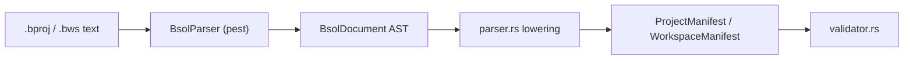

import SpecArticleChrome from '@beskid/beskid-ui/platform-spec/SpecArticleChrome.astro';

<SpecArticleChrome />

## Vocabulary

| Construct | Role |
| --- | --- |
| **`bsol.pest`** | Authoritative PEG grammar (single syntactic truth for manifests) |
| **`BsolParser`** | Pest-derived parser entry type |
| **`BsolDocument`** | Root AST node: ordered top-level blocks |
| **`ProjectManifest` / `WorkspaceManifest`** | Typed models produced **after** Bsol lowering + contract validation |

## Pipeline



## Lexical rules

- **Whitespace** (` `, tab, newline) is insignificant except as a separator.
- **Comments:** `#` to end of line, or `//` to end of line (not inside string literals at the grammar layer; manifest authors should avoid `#` inside quoted paths).
- **Identifiers:** ASCII letter or `_`, then alphanumeric/`_`.
- **Quoted strings:** `"..."` with no escape sequences (content between quotes is literal).
- **Bracket lists:** `[ item (, item)* ]` where each item is `default`, an identifier, or a quoted string.
- **Assignments:** `ident = value` with optional surrounding whitespace.

## Surface document shape

A Bsol document is a sequence of blocks. Each block is one of:

| Form | Example |
| --- | --- |
| Named project root | `myapp { name = "myapp" ... }` |
| Labeled reserved block | `target "main" { kind = App ... }` |
| Unlabeled reserved block | `link { libraries = [libc] }` |

**Reserved top-level keywords** (cannot be used as a project root ident): `target`, `dependency`, `link`, `workspace`, `member`, `override`, `registry`.

Nested blocks allowed **only** inside a project root body: `mod` / `meta`, `template`.

## Normative Rust AST

The reference compiler **must** build the following types from a successful Bsol parse. Field names and enum variants are stable contract surface for tooling, LSP, and test fixtures.

```rust
/// A parsed `.bproj` or `.bws` document.
pub struct BsolDocument {
    pub blocks: Vec<BsolBlock>,
}

/// One top-level block in a manifest file.
pub struct BsolBlock {
    pub span: BsolSpan,
    pub header: BsolBlockHeader,
    pub body: Vec<BsolBodyItem>,
}

/// Block header: either a named project root or a reserved manifest block kind.
pub enum BsolBlockHeader {
    /// `{ myapp { name = "myapp" ... } }` — block kind must match lowered `name`.
    ProjectRoot { ident: String },
    /// Reserved blocks such as `target "main" { ... }`.
    Reserved {
        kind: BsolReservedBlockKind,
        label: Option<BsolQuotedString>,
    },
}

pub enum BsolReservedBlockKind {
    Target,
    Dependency,
    Link,
    Workspace,
    Member,
    Override,
    Registry,
}

pub enum BsolBodyItem {
    Assignment(BsolAssignment),
    NestedBlock(BsolNestedBlock),
}

pub struct BsolNestedBlock {
    pub span: BsolSpan,
    pub kind: BsolNestedBlockKind,
    pub assignments: Vec<BsolAssignment>,
}

pub enum BsolNestedBlockKind {
    Mod,
    Meta,     // legacy alias; lowered identically to Mod
    Template,
}

pub struct BsolAssignment {
    pub span: BsolSpan,
    pub key: String,
    pub value: BsolValue,
}

pub enum BsolValue {
    QuotedString(BsolQuotedString),
    Ident(String),
    BracketList(BsolBracketList),
}

pub struct BsolQuotedString {
    pub span: BsolSpan,
    pub value: String,
}

pub struct BsolBracketList {
    pub span: BsolSpan,
    pub items: Vec<BsolListItem>,
}

pub enum BsolListItem {
    Default,
    QuotedString(BsolQuotedString),
    Ident(String),
}

/// UTF-8 source span with 1-based line index for diagnostics.
pub struct BsolSpan {
    pub start: usize,
    pub end: usize,
    pub line: usize,
}
```

Source of truth in the repository: `compiler/crates/beskid_analysis/src/projects/bsol/ast.rs`.

## Lowering boundary

Bsol parsing **stops** at `BsolDocument`. The following are **not** Bsol syntax errors—they are manifest contract failures during lowering or validation:

- Missing required fields (`name`, `version`, target labels, dependency labels)
- Unknown or misplaced nested blocks (`mod` on host projects)
- Meta-contract band **E1801–E1899** (for example legacy `project { }`, corelib opt-out keys)
- Graph and lockfile rules in compiler resolution features

Public entry points:

| API | Returns |
| --- | --- |
| `parse_bsol_document(&str)` | `Result<BsolDocument, ProjectError>` |
| `parse_manifest(&str)` | `Result<ProjectManifest, ProjectError>` |
| `parse_workspace_manifest(&str)` | `Result<WorkspaceManifest, ProjectError>` |

## Relationship to Beskid surface syntax

Bsol is a **distinct** meta-language from Beskid `.bd` source. It shares the pest-based implementation stack but uses its own grammar file (`bsol.pest`) and AST module (`projects/bsol/`). Beskid program syntax remains specified under **[Surface syntax](/platform-spec/language-meta/surface-syntax/)**.
