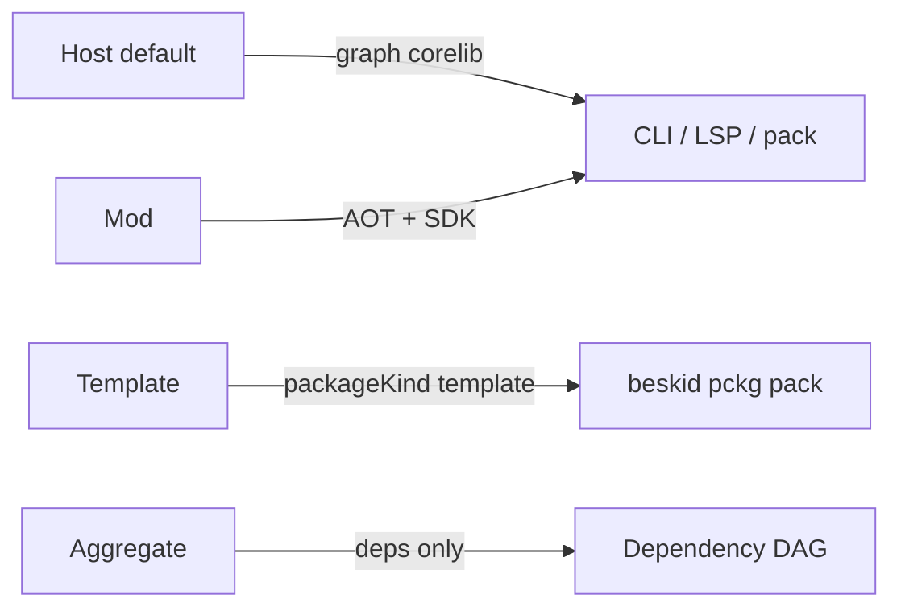

import SpecArticleChrome from '@beskid/beskid-ui/platform-spec/SpecArticleChrome.astro';

<SpecArticleChrome />

## Purpose

Tooling-facing shape of **`.bproj`** project manifests: project kind, mod orchestration block, template metadata, readme publishing, and host `app` launch rules. Files are written in **[Bsol](/platform-spec/tooling/manifests-and-lockfiles/bsol/)** and parsed to `BsolDocument` before lowering to `ProjectManifest`. Resolution-graph behavior and diagnostic bands live in **[Project manifest contract (compiler)](/platform-spec/compiler/resolution-and-projects/project-manifest-contract/)**—this article does not duplicate full manifest key tables from the manifests area hub.

## On-disk naming

| Rule | Detail |
| --- | --- |
| Extension | **`.bproj`** only (legacy **`Project.proj`** → **E1894**) |
| Location | Project root; exactly one `*.bproj` per directory |
| Filename | **Should** equal `{name}.bproj` (for example `corelib.bproj` when `name = "corelib"`) |

## Named root block

The manifest **must** contain exactly one named root block. The block kind **must** equal the `name` field (**E1896** on mismatch). The legacy `project { ... }` wrapper is rejected (**E1894**).

```text
myapp {
  name    = "myapp"
  version = "0.1.0"
  root    = "Src"
}

target "App" {
  kind  = App
  entry = "Main.bd"
}
```

## Extras on the root block

Keys other than `name`, `version`, `root`, `root_namespace`, `type`, and `readme` are stored in **`project.extras`**. The compiler **must not** interpret extras unless a feature contract names them. Manifests **must not** use extras to opt out of corelib graph attachment (`noCorelib`, `useCorelib = false` → **E1876**).

## Project kinds



| `type` | Role |
| --- | --- |
| *(omitted)* | **`Host`** — default application or library project |
| **`Mod`** | Compiler-mod package (see below) |
| **`Template`** | Template authoring; published as **`packageKind: template`** |
| **`Aggregate`** | Dependency-only aggregate; **must not** declare `target` blocks; **must** declare at least one `dependency` |

Unknown `type` values **must** be rejected at structural parse time (**E1807**).

### Host projects and corelib

Every host project **must** resolve **corelib** through toolchain graph attachment (implicit `Std` / `corelib` path when not already declared). This is **dependency graph** wiring only—see **[Explicit use, no prelude](/platform-spec/tooling/manifests-and-lockfiles/adr/0006-explicit-use-no-prelude/)** for symbol visibility. Manifests **must not** define `noCorelib`, `useCorelib: false`, or equivalent opt-out keys.

### Aggregate projects (`Aggregate`)

Aggregate manifests model packages that exist only to group path dependencies—canonical **`corelib`** is the reference:

```text
corelib {
  name    = "corelib"
  version = "0.1.0"
  type    = Aggregate
}

dependency "corelib_foundation" {
  source = path
  path   = "../packages/foundation"
}
```

| Rule | Detail |
| --- | --- |
| Targets | **Forbidden** — **E188x** band when `target` blocks are present |
| Dependencies | **Required** — at least one `dependency` block |
| `root` | Defaults to empty string when omitted (no standalone source tree on the aggregate node) |
| Prelude | Aggregate corelib **must not** ship `Prelude.bd`; consumers import shard modules via explicit `use` after path/registry deps |

## Targets and `entry`

| `target.kind` | `entry` |
| --- | --- |
| **`App`** | **Required** — path relative to `project.root` |
| **`Test`** | **Required** |
| **`Lib`** | **Optional** — when omitted, tooling discovers `.bd` files under `project.root` (workspace scan) |

## Package readme (`readme`)

The root block **may** include `readme = "relative/path.md"`. When omitted, tooling treats **`readme.md`** at the project root as the default when present. `beskid pckg pack` publishes the resolved file as root **`README.md`** in the `.bpk` artifact.

## Mod project type (`Mod`)

When set to **`Mod`**, the manifest denotes a compiler-mod package discovered through dependency resolution, compiled AOT, and loaded via SDK contracts during host compilation. User-visible contract semantics: **[Compiler Mod SDK](/platform-spec/language-meta/metaprogramming/compiler-mod-sdk/)**.

### On-disk nesting

```text
my_mod {
  name    = "my_mod"
  version = "0.1.0"
  type    = Mod
  mod {
    maxGeneratorRounds = 4
    capabilities       = [emit_syntax]
  }
}
```

### Normative `mod { }` keys (v0.2 target)

| Key | Required | Meaning |
| --- | --- | --- |
| `maxGeneratorRounds` | no | Positive cap on generator replay; default `4` |
| `capabilities` | no | Closed vocabulary (`emit_syntax`, `read_project_sources`, `query_semantic_snapshot`, `extern_ffi`, `rewrite_syntax`) |
| `artifactPolicy` | no | Cache policy for fetched mods (`reuse`, `rebuild`, `clean_rebuild`) |

Validation phases: structural parse in `ProjectManifest` build, then graph validation for mod topology (**E1801–E1899** band).

## Application host and `app` target

Hosted applications use the **`app`** executable target. The entry module **must** perform exactly one **`launch SomeHost(...)`** per run. **`Lib`** projects **may** declare reusable **`host`** types but **must not** use **`launch`**.

## Template project type (`Template`)

Optional nested block:

```text
my_template {
  name    = "my_template"
  version = "0.1.0"
  type    = Template
  template {
    shortName = "console"
    identity  = "beskid.templates.console"
  }
}
```

Authoritative engine manifest: **`.beskid/template.json`** (`beskid.template.v1`). See **[Template packages](/platform-spec/tooling/project-scaffolding/template-packages/)**.

## Implementation anchors

- Parse + validation: `compiler/crates/beskid_analysis/src/projects/parser.rs`, `validator.rs`
- Discovery: `compiler/crates/beskid_analysis/src/projects/discovery.rs` (`.bproj`, E1894)
- Manifest resolve: `compiler/crates/beskid_analysis/src/projects/manifest_resolve.rs`
- Graph + plan: `compiler/crates/beskid_analysis/src/projects/graph/`, `compile_plan.rs`
- Pack profile: `compiler/crates/beskid_pckg/src/pack.rs`
