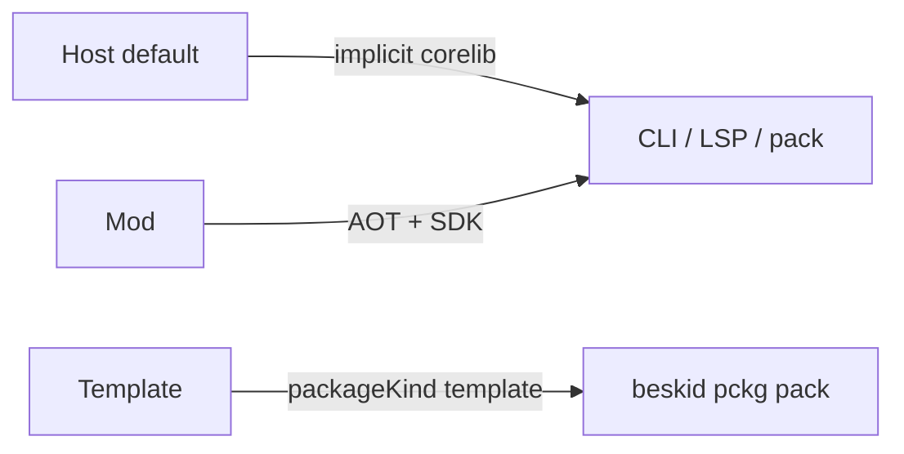

import SpecArticleChrome from '@beskid/beskid-ui/platform-spec/SpecArticleChrome.astro';

<SpecArticleChrome />

## Purpose

Tooling-facing shape of **`Project.proj`**: project kind, mod orchestration block, template metadata, readme publishing, and host `app` launch rules. Files are written in **[Bsol](/platform-spec/tooling/manifests-and-lockfiles/bsol/)** and parsed to `BsolDocument` before lowering to `ProjectManifest`. Resolution-graph behavior and diagnostic bands live in **[Project manifest contract (compiler)](/platform-spec/compiler/resolution-and-projects/project-manifest-contract/)**—this article does not duplicate full manifest key tables from the manifests area hub.

## Project kinds



| `project.type` | Role |
| --- | --- |
| *(omitted)* | **`Host`** — default application or library project |
| **`Mod`** | Compiler-mod package (see below) |
| **`Template`** | Template authoring; published as **`packageKind: template`** |

Unknown `project.type` values **must** be rejected at structural parse time.

### Implicit corelib (host projects)

Every host project **must** resolve **corelib** through toolchain defaults. Manifests **must not** define `noCorelib`, `useCorelib: false`, or equivalent opt-out keys.

## Package readme (`readme`)

The `project` block **may** include `readme = "relative/path.md"`. When omitted, tooling treats **`readme.md`** at the project root as the default when present. `beskid pckg pack` publishes the resolved file as root **`README.md`** in the `.bpk` artifact.

## Mod project type (`Mod`)

When set to **`Mod`**, the manifest denotes a compiler-mod package discovered through dependency resolution, compiled AOT, and loaded via SDK contracts during host compilation. User-visible contract semantics: **[Compiler Mod SDK](/platform-spec/language-meta/metaprogramming/compiler-mod-sdk/)**.

### On-disk nesting

```text
project:
  name: ...
  type: Mod
  mod:
    maxGeneratorRounds: 4
    capabilities: [emit_syntax]
```

### Normative `project.mod` keys (v0.2 target)

| Key | Required | Meaning |
| --- | --- | --- |
| `maxGeneratorRounds` | no | Positive cap on generator replay; default `4` |
| `capabilities` | no | Closed vocabulary (`emit_syntax`, `read_project_sources`, `query_semantic_snapshot`, `extern_ffi`, `rewrite_syntax`) |
| `artifactPolicy` | no | Cache policy for fetched mods (`reuse`, `rebuild`, `clean_rebuild`) |

Validation phases: structural parse in `ProjectManifest` build, then graph validation for mod topology (**E1801–E1899** band).

## Application host and `app` target

Hosted applications use the **`app`** executable target. The entry module **must** perform exactly one **`launch SomeHost(...)`** per run. **`Lib`** projects **may** declare reusable **`host`** types but **must not** use **`launch`**.

## Template project type (`Template`)

Optional nested block:

```text
project {
  type = Template
  template {
    shortName = "console"
    identity  = "beskid.templates.console"
  }
}
```

Authoritative engine manifest: **`.beskid/template.json`** (`beskid.template.v1`). See **[Template packages](/platform-spec/tooling/project-scaffolding/template-packages/)**.

## Implementation anchors

- Parse + validation: `compiler/crates/beskid_analysis/src/projects/parser.rs`, `validator.rs`
- Manifest resolve: `compiler/crates/beskid_analysis/src/projects/manifest_resolve.rs`
- Graph + plan: `compiler/crates/beskid_analysis/src/projects/graph/`, `compile_plan.rs`
- Pack profile: `compiler/crates/beskid_pckg/src/pack.rs`
