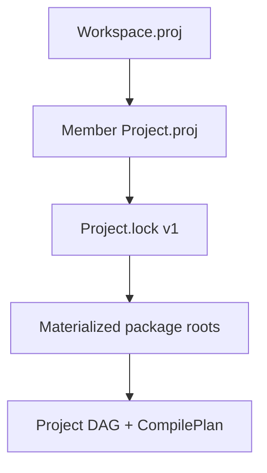

import SpecArticleChrome from '@beskid/docs-ui/platform-spec/SpecArticleChrome.astro';

<SpecArticleChrome />

## Purpose

Tooling-facing contract for **`Workspace.proj`**, per-member **`Project.proj`** graphs, and **`Project.lock`** v1 files that pin materialized dependency roots. The compiler realizes graph resolution and lock sync in `beskid_analysis::projects`; this article defines what operators and CLI commands may assume without restating full manifest key tables.

## Artifacts

| Artifact | Role |
| --- | --- |
| **`Workspace.proj`** | Declares `member` projects, registry URL aliases, optional dependency overrides |
| **`Project.proj`** | Declares dependencies, targets, project kind (`Host`, `Mod`, `Template`) — see **[Project manifest contract](/platform-spec/tooling/manifests-and-lockfiles/project-manifest-contract/)** |
| **`Project.lock`** | Records `root_manifest`, resolved dependency names, `manifest` paths, `source_root`, `materialized_root` |
| **`workspace.package.json`** | Optional npm-style metadata for editor hints; not a compiler graph input |

## Resolution rules surface

`WorkspaceResolutionRules` (in `resolver.rs`) carries:

- `workspace_root` and `workspace_members`
- `overrides_by_dependency` (version pins)
- `registry_aliases` and `registry_urls` for `beskid fetch` / registry client

Registry dependencies resolve through **`beskid_pckg`** HTTP flows; path dependencies normalize under the consumer project root.

## Lockfile semantics (tooling view)

- Header **must** be `# Project.lock v1`.
- Each dependency line **must** include `name`, `manifest`, `project`, `source_root`, `materialized_root`.
- `beskid lock` synchronizes lock content from the current `CompilePlan` (`sync_project_lockfile` in `workflow.rs`).
- LSP may replay `effective_roots_from_lockfile` when a prepared workspace cache is absent.

## Workspace readme

The `workspace` block **may** include `readme = "relative/path.md"` with the same publishing behavior as project readmes (pack → root `README.md` in `.bpk`). Details live under **[Project manifest contract — design model](/platform-spec/tooling/manifests-and-lockfiles/project-manifest-contract/design-model/#package-readme-readme)**.

## Implementation anchors

- Lock format + sync: `compiler/crates/beskid_analysis/src/projects/workflow.rs`
- Graph resolver: `compiler/crates/beskid_analysis/src/projects/graph/resolver.rs`
- CLI: `compiler/crates/beskid_cli/src/commands/lock.rs`, `fetch.rs`, `update.rs`
- Lock replay: `compiler/crates/beskid_analysis/src/projects/assembly/roots.rs`
