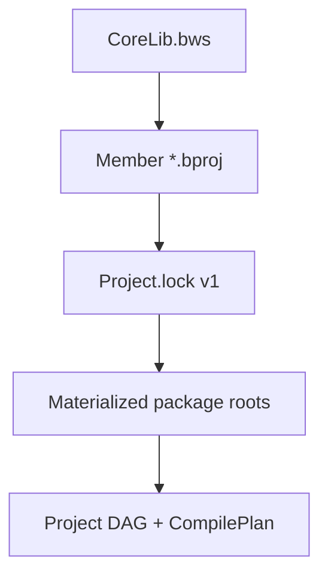

import SpecArticleChrome from '@beskid/beskid-ui/platform-spec/SpecArticleChrome.astro';

<SpecArticleChrome />

## Purpose

Tooling-facing contract for **`.bws`** workspace manifests, per-member **`.bproj`** graphs, and **`Project.lock`** v1 files that pin materialized dependency roots. The compiler realizes graph resolution and lock sync in `beskid_analysis::projects`; this article defines what operators and CLI commands may assume without restating full manifest key tables.

## Artifacts



| Artifact | Role |
| --- | --- |
| **`.bws` workspace manifest** | Declares `member` projects, registry URL aliases, optional dependency overrides; legacy **`Workspace.proj`** → **E1895** |
| **`.bproj` member manifest** | Declares dependencies, targets, project kind (`Host`, `Mod`, `Template`, `Aggregate`) — see **[Project manifest contract](/platform-spec/tooling/manifests-and-lockfiles/project-manifest-contract/)** |
| **`Project.lock`** | Records `root_manifest`, resolved dependency names, `manifest` paths, `source_root`, `materialized_root` |

## Workspace block and extras

Known fields on `workspace { }`: **`name`**, **`resolver`** (default `v1`). Additional keys land in **`workspace.extras`**.

| Extra key | Semantics |
| --- | --- |
| **`defaultTestMember`** | Member label selected when resolving a workspace path without `--workspace-member` and without a source path under a member tree |
| **`schema`** | Informational workspace schema id (for example `beskid.workspace.v1`); not a compiler graph input |

Example:

```text
workspace {
  name               = "corelib"
  resolver           = v1
  schema             = "beskid.workspace.v1"
  defaultTestMember  = "corelib_tests"
}
```

## Member blocks and merged metadata

Each `member "<label>" { path = "..." }` block **must** include a unique label and **`path`** relative to the workspace root. Keys other than **`path`** are stored in **`member.extras`**—publish and editor metadata merged from the workspace manifest, **not** a substitute for the member's `.bproj`:

| Extra key | Role |
| --- | --- |
| **`package`** | Registry package id for the member (may differ from `.bproj` `name`) |
| **`description`** | Human-readable summary for registry UI and docs |
| **`category`** | Coarse kind hint (for example `Library`, `Test`) |
| **`tags`** | Search/filter tags (Bsol bracket list or repeated assignments per Bsol profile) |

```text
member "foundation" {
  path        = "packages/foundation"
  package     = "corelib_foundation"
  description = "Low-level primitives shared by Beskid corelib workspace packages."
  category    = "Library"
  tags        = ["corelib", "foundation", "beskid"]
}
```

Member selection when `--workspace-member` is omitted: longest-prefix match of the input path against member roots, then **`defaultTestMember`**, then the first declared member.

## Resolution rules surface

`WorkspaceResolutionRules` (in `resolver.rs`) carries:

- `workspace_root` and `workspace_members`
- `overrides_by_dependency` (version pins)
- `registry_aliases` and `registry_urls` for `beskid fetch` / registry client

Registry dependencies resolve through **`beskid_pckg`** HTTP flows; path dependencies normalize under the consumer project root.

## Lockfile semantics (tooling view)

- Header **must** be `# Project.lock v1`.
- Each dependency line **must** include `name`, `manifest`, `project`, `source_root`, `materialized_root`.
- `beskid lock` synchronizes lock content from the current `CompilePlan` (`sync_project_lockfile` in `workflow.rs`).
- LSP may replay `effective_roots_from_lockfile` when a prepared workspace cache is absent.

## Workspace readme

The `workspace` block **may** include `readme = "relative/path.md"` with the same publishing behavior as project readmes (pack → root `README.md` in `.bpk`). Details live under **[Project manifest contract — design model](/platform-spec/tooling/manifests-and-lockfiles/project-manifest-contract/design-model/#package-readme-readme)**.

## Implementation anchors

- Lock format + sync: `compiler/crates/beskid_analysis/src/projects/workflow.rs`
- Graph resolver: `compiler/crates/beskid_analysis/src/projects/graph/resolver.rs`
- Member selection: `compiler/crates/beskid_analysis/src/projects/manifest_resolve.rs`
- CLI: `compiler/crates/beskid_cli/src/commands/lock.rs`, `fetch.rs`, `update.rs`
- Lock replay: `compiler/crates/beskid_analysis/src/projects/assembly/roots.rs`
