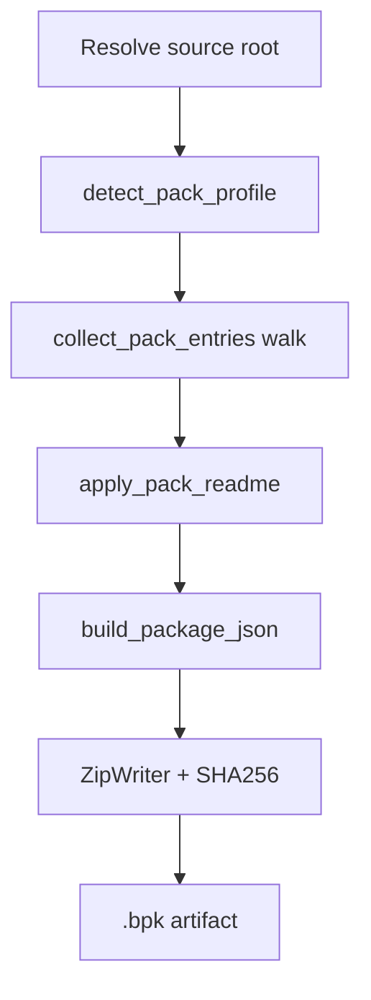

import SpecArticleChrome from '@beskid/beskid-ui/platform-spec/SpecArticleChrome.astro';

<SpecArticleChrome />

## `beskid pckg pack` algorithm

1. Read `Project.proj` when present; choose `PackProfile::Library` or `Template`.
2. Walk files (respect template exclude strips via `strip_template_pack_excludes`).
3. Include `.beskid/docs/**` and package docs for library profiles.
4. Copy resolved readme to zip root `README.md` when not already present.
5. Emit `package.json` metadata (registry assigns version on publish—clients do not invent release versions in normal flows).

## Publish / upload

1. Build or locate `.bpk` bytes.
2. `PckgClient::send_multipart` to registry upload endpoint with publisher auth.
3. Server runs `PackageArtifactValidator` + documentation ingestion; failures return structured API errors mapped to `PckgError::Api`.

## Fetch into workspace

`beskid fetch` (CLI command in `beskid_cli`) uses registry URLs from `Workspace.proj` and downloads through `PckgClient`, writing materialized roots recorded later in `Project.lock`. Version resolution follows registry-assigned versions, not ad-hoc client version strings.

## Version state file

Pack may persist local version hints in `.beskid/pckg` state (`PackVersionState`) for iterative dev publishes; production CI should rely on server-assigned versions after upload.

## Error handling

All HTTP failures surface as `PckgError` with status, message, and optional body text suitable for `--verbose` CLI output.
